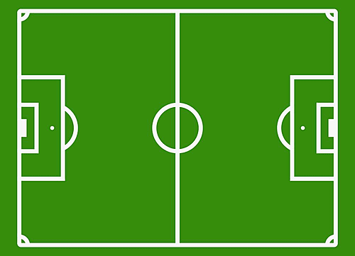

# NOM DU TP

Introduction

# Première partie 

## Sous partie 1

Blabla des formules :

$N_{dt}$=$N_0$ $e^{(-\mu(E)x)}$

$\ln(\frac{N_{dt}}{N_0}) = - \mu(E)x$

$\mu(E) = \frac{ln(\frac{N_0}{N_{dt}})}{x}$

Du texte :

Où $N_0$ est le nombre de photons incident sur l'objet d’épaisseur _x_ et _µ_ le coefficient d'atténuation linéique à l'énergie E.

Nous cherchons le nombre de photons incidents nécessaires pour obtenir une précision de $10^{-3}$ afin d’avoir les coefficients d’atténuations avec cette même précision.

La précision tout comme l’incertitude relative s’exprime sans unité, nous pouvons donc traduire l’énoncé par l’équation suivante :

$\frac{\sigma_{\mu}}{\mu}$ = $10^{-3}$

Sachant que la formule de la variance est :

$$
\mathrm{Var}[y]=\sum_{i=1}^N\left(\dfrac{\partial y}{\partial x_i}\right)^2\mathrm{Var}[x_i]
$$

Avec $y = \mu = \frac{ln(\frac{N_0}{n_{dt}})}{x}$

Comme _x_ et $N_0$ sont des valeurs dont nous connaissons la certitude, µ ne varie que selon $N_{dt}$ donc on en déduit que $x_i$ = $N_{dt}$

$$\mathrm{Var}[\mu] = \left(\frac{d}{dN_{dt}}\ln\left(\frac{N_{dt}}{N_0}\right)\right)^2 \times \frac{1}{x^2}$$

Le nombre de photons transmits suit une loi de Poisson, on a donc Var[$N_{dt}$] = $N_{dt}$

On a donc, en remplacant $$\mathrm{Var}(\mu) = \frac{1}{x^2}\frac{1}{N_{dt}} $$

D'après la loi de Beer-Lambert, $N_{dt}$ = $N_0$ $e^{(- \mu x)}$

En remplacant dans la formule de la variance : 

$$\mathrm{Var}[\mu] = \frac{1}{x^2}\frac{1}{ N_0 e^{(- \mu x)}}$$ 

On obtient finalement $N_0$ = $\frac{1}{(\mu x\times 10^{-3})^2 e^{(-{\mu}x)}}$

### Sous-sous partie 
avec image :

On note ici que pour 1000 photons émis, nous avons 540 photons transmis pour une épaisseur de 3,9 cm de H2C. 

Donc on écrit et résout l'équation : 

$540 = 1000 e^{(-3,9 \mu)}$

$$\rightarrow \mu = 0,161   \mathrm{cm}^{-1}$$

Le coefficient d'atténuation théorique, obtenu grâce au graphique ci-dessous (cercle jaune): 

On trouve donc $$ \mu \approx 0,16   \mathrm{cm}^{-1}$$
Ce résultat est très proche de notre résultat obtenu.

Donc pour respecter notre condition $$N_0 \geq \frac{10^{6}}{(x\mu)^2}e^{(-\mu x)}$$

On trouve $N_0$ = 4 752 395 

### Sous sous partie 2
Calculons $\mu$ pour le plomb avec la même simulation : 

Donc on résout l'équation : 

$$547 = 1000 e^{-0,01\mu}$$

$$\rightarrow \mu = 62,33   \mathrm{cm}^{-1}$$

Le coefficient d'atténuation théorique, obtenu grâce au graphique ci-dessous : 

On trouve donc :

$$ \mu \approx 61  \mathrm{cm}^{-1}$$

## Sous partie 2

blablabla

# Deuxième partie

##  Sous partie 

Un tableau

| Matériau | Energie moyenne (keV) | µ(E) |
|-----------|-----------|-----------|
| Plomb | 85,86 | 25 |
| Cuivre | 92,34  | 4 |

## Plus gros tableau

| Epaisseur (mm) | HVL (mm Al)   |
|----------------|---------------|
| 0              | 2.37
| 2.37           | 4.22
| 6.59           | 6.16
| 12.75          | 7.77
| 20.52          | 8.96
| 29.48          | 9.83
| 39.31          | 10.47
| 49.78          | 10.98
| 60.76          | 11.38
| 72.14          | 11.72
| 83.86          | 12

Quelques formules

$ 1000  px : 3.83  cm $
$ h_1   px : 1.99  cm $

$$
\rightarrow h_1 = \frac{1.99}{3.83}\times 1000 = 518.23 px
$$

$1000   px : 4.04 cm$
$h_2  px : 3.38 cm$ 

$$
\rightarrow h_2 = \frac{3.38}{4.04}\times 1000 = 836.63   px
$$

On applique ensuite le théorème de Thalès pour déterminer _d_ :

_Théorème de Thalès :_

$$
\frac{518.23}{836.63} = \frac{d-75}{d}
$$

$$
d = \frac{75\times 836.63}{836.63-518.23} = 197.07 cm \approx 2 m
$$

Nous pouvons donc conclure que le détecteur et la source sont séparés de 2m environ.

On peut écrire :

$$
SPR(zone) = \frac{\mathrm{Max(valeur(zone,0cm)) - valeur(zone, 75 cm)}}{\mathrm{valeur(zone, 75 cm)}}
$$
Nous allons utiliser les spectres pour les deux cas de notre expérience : 

En italique : 
_contre le detecteur_

### Conclusion 

En conclusion, il est observé que le rayonnement diffusé prédomine en direction du détecteur. La proximité d'un objet par rapport à la source accroît sa probabilité de détection. De plus, l'augmentation de l'épaisseur traversée induit une hausse du rayonnement diffusé, comme le confirme l'augmentation du SPR.

Par conséquent, pour obtenir une image radiologique de qualité sans amplification excessive d'un élément, il est essentiel de le positionner le plus près possible du détecteur.

