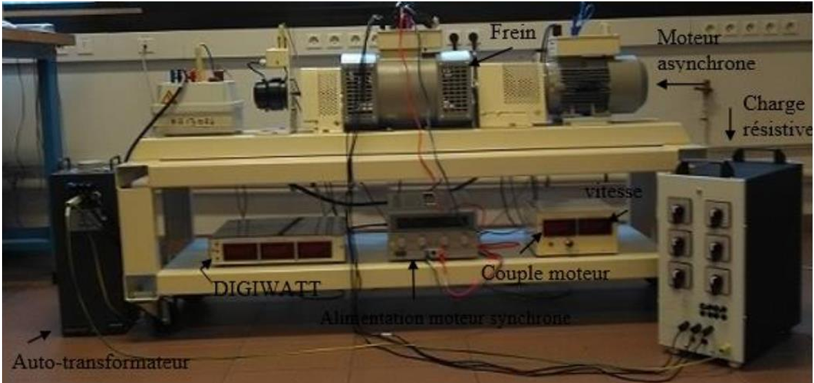

# Introduction

Dans ce travail pratique, l'objectif est d'analyser le fonctionnement d'un moteur asynchrone triphasé sous différentes conditions de charge et de tension d'alimentation. En s'appuyant sur ses caractéristiques nominales et sur les équations issues du bilan des puissances et des pertes, il est possible d'identifier les principaux paramètres influençant son rendement et son efficacité énergétique.  

Les données fournies par la plaque signalétique, telles que la tension, l'intensité, le déphasage, la fréquence et la puissance nominale, servent de référence pour nos expérimentations. Par ailleurs, des grandeurs comme la vitesse de synchronisme, le glissement et le couple utile au point nominal sont calculées afin d'approfondir la compréhension du moteur.  

L'analyse des résultats expérimentaux, incluant les mesures des puissances active, réactive et apparente, ainsi que l'évaluation des pertes joule au stator et des pertes constantes, permettra de déterminer le rendement du moteur et d'étudier son comportement en fonction de la charge et de la tension d'alimentation.

## Travail préparatoire

### Caractéristiques nominales et bilan des puissances  

À partir des caractéristiques nominales du moteur et des équations issues du bilan des puissances et des pertes, il est possible d'établir les points suivants :  

- Les valeurs des grandeurs indiquées sur la plaque signalétique correspondent aux conditions pour lesquelles le moteur atteint son rendement maximal.  
- Un montage en étoile sera utilisé lors des manipulations afin d'assurer une distribution équilibrée de la tension et une meilleure stabilité du système. Un couplage en triangle serait préférable en cas de besoin d'une tension de phase plus élevée et d'une puissance apparente maximale.  

### Données nominales (montage en étoile)  

| Grandeur | Valeur |
|----------|--------|
| **Tension nominale efficace (U)** | 400 V |
| **Intensité nominale efficace (I)** | 3,4 A |
| **Facteur de puissance (cos($\phi$))** | 0,77 |
| **Fréquence (f)** | 50 Hz |
| **Vitesse nominale (N)** | 1440 tr/min |
| **Puissance utile nominale (PUtile)** | 1,5 kW |

### Calculs aux conditions nominales  

- **Vitesse de synchronisme**  

$N_s = \frac{1500 \cdot 2\pi}{60} = 157,08 \text{ rad/s}$

- **Nombre de paires de pôles du moteur**  

$p = \frac{f}{N_s} = \frac{50}{\frac{1500}{60}} = 2$

- **Glissement**

$s = \frac{N_s - N}{N_s} \cdot 100 = \frac{1500 - 1440}{1500} \cdot 100 = 4,2\%$

- **Couple utile au point nominal**  

$C_U = \frac{P_{\text{utile}}}{\Omega} = \frac{1500}{150} = 10 \text{ N.m}$

- **Puissance active (réellement consommée)**  

$P_{\text{abs}} = \sqrt{3} \cdot U \cdot I \cdot \cos(\phi)$

$P_{\text{abs}} = \sqrt{3} \cdot 400 \cdot 3,4 \cdot 0,77 = 1814 \text{ W}$

- **Puissance réactive (perdue au stator)**

$Q = \sqrt{S^2 - P^2}$

$Q = 1056 \text{ W}$

- **Puissance apparente (dimensionnement des installations électriques)**  

$S = \sqrt{3} \cdot U \cdot I$

$S = \sqrt{3} \cdot 400 \cdot 3,4 = 2356 \text{ W}$

- **Rendement nominal du moteur**

$\eta = \frac{P_{\text{utile}}}{P_{\text{abs}}}$

$\eta = \frac{1500}{1814} = 0,83$

## Dispositif expérimental

Voici la liste des appareils permettant d’analyser le fonctionnement du moteur asynchrone triphasé (voir Figure \ref{fig:banc_charge}):  

- **Autotransformateur** : Permet de fixer la tension d’entrée et de la maintenir constante, quelle que soit la tension fournie par le réseau.  
- **Boîtier DIGIWATT** : Utilisé pour mesurer les valeurs efficaces de la tension (**U**), de l’intensité (**I**) et de la puissance absorbée ($P_abs$).  
- **Moteur asynchrone triphasé SIEMENS** : Connecté en triangle, car la salle dispose d’un réseau triphasé EDF 400V.  
- **Frein** :  
  - Le freinage est assuré par un alternateur entraîné par le moteur asynchrone.  
  - L’alternateur débite un courant dans une charge résistive variable (réglable de 5% à 95%).  
  - Il ne fonctionne que si sa bobine d’induction est alimentée.  
  - La tension et l’intensité appliquées ne doivent pas dépasser respectivement **47 V** et **2,5 A**.  

{#fig:banc_charge}

### Notations utilisées  

- **Couple moteur** : noté **$T_u$** (N·m).  
- **Vitesse de rotation** : notée **N** (tr/min), convertie en **$\Omega$** (rad/s).  

### Conditions de mesure  

Les mesures sont réalisées pour deux tensions d’alimentation différentes :  
- **230 V**  
- **400 V**  

# Expériences

# Conclusion

