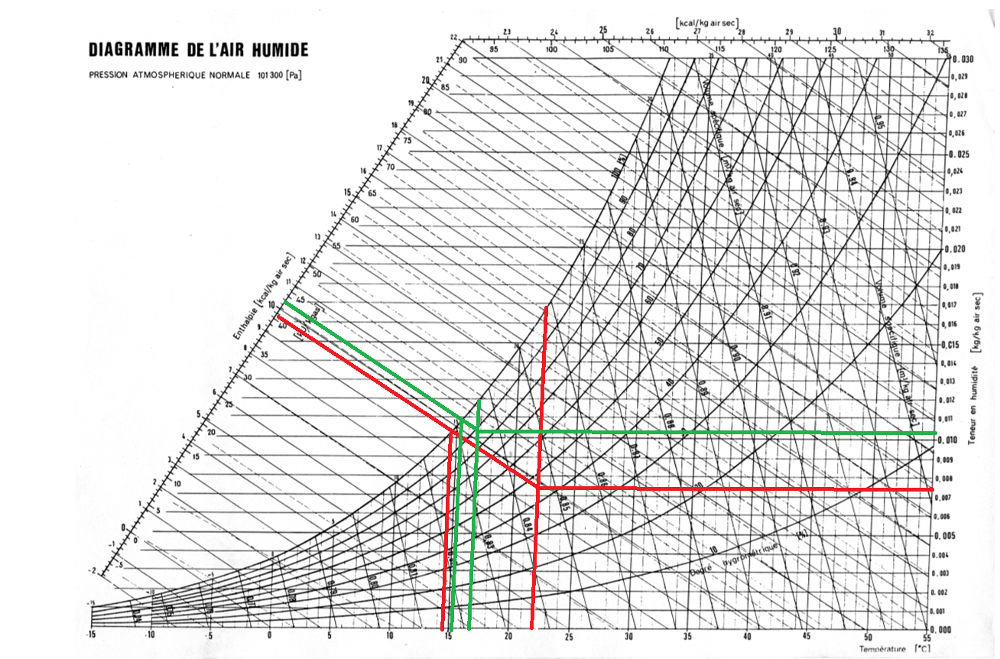

# Introduction

## Objectifs
Ce TP a pour objectif principal l’étude du fonctionnement d’une tour de refroidissement. Il s’agit de comprendre les phénomènes d’échange thermique et massique entre l’air et l’eau, et d’analyser l’influence de différents paramètres sur l’efficacité du refroidissement, comme le débit d’air, la charge thermique ou encore la vitesse d’écoulement.

## Contexte
Dans les installations industrielles, la gestion de la chaleur est un enjeu crucial. Les tours de refroidissement sont largement utilisées pour évacuer la chaleur excédentaire de manière économique et efficace. Ce TP s’inscrit dans ce cadre en proposant l’analyse d’un dispositif expérimental à échelle réduite, permettant de modéliser et de mieux comprendre le fonctionnement réel de ces systèmes.

## Notions clefs
- **Refroidissement par évaporation** : transfert de chaleur de l’eau vers l’air, par évaporation partielle de l’eau.
- **Bilans d’énergie et de masse** : permettent d’évaluer l’efficacité de la tour.
- **Air humide** : mélange air-vapeur dont les propriétés sont déterminées par la température sèche, la température de bulbe humide et l’humidité absolue.
- **Diagramme psychrométrique** : outil graphique essentiel pour caractériser les états thermodynamiques de l’air humide.

## Matériel utilisé

- **Banc expérimental de tour de refroidissement** miniature avec :
  - Un **circuit d’eau** : réservoir chauffant, pompe, garnissage, réservoir de récupération.
  - Un **circuit d’air** : ventilateur à débit réglable, dispositif de récupération de gouttelettes.
- **Instruments de mesure** :
  - Thermocouples (eau et air, en entrée et sortie)
  - Débitmètre pour l’eau
  - Manomètre à colonne d’eau (pour le débit d’air)
  - Résistance chauffante (pour simuler la charge thermique)
- **Outils d’analyse** :
  - Diagramme psychrométrique
  - Table de données expérimentales (en cas de mesures non fiables)

# Travail préliminaire

Avant de réaliser les manipulations expérimentales, un travail préliminaire a été effectué afin de mieux comprendre les propriétés de l’air humide, indispensable pour établir les bilans thermodynamiques de la tour de refroidissement.

## Propriétés de l’air humide

Les conditions atmosphériques de départ sont les suivantes :

- Pression atmosphérique : **1,013 bar** (soit 101300 Pa)
- Température sèche : **20°C**
- Température de bulbe humide : **14°C**
- Pression de vapeur saturante à 14°C : **1599 Pa** (issue des tables thermodynamiques)

À partir de ces données, plusieurs grandeurs caractéristiques ont été calculées :

**Pression partielle de vapeur d’eau (Pv)**

$P_v = P_{vs} - 6,666 \cdot 10^{-4} \cdot P_{atm} \cdot (\Theta - \Theta_h)$

Avec : 

- $P_v$ la pression partielle de l’eau dans l’air en mbar
- $P_{vs}$la pression de saturation de la vapeur d’eau à la température du bulbe humide $\Theta_h$ en mbar.
- $P_{atm}$ la pression totale de l’air (pression atmosphérique : 1013,25 mbar);
- $\Theta$ la température sèche de l’air en °C ;
- $\Theta_h$ la température du bulbe humide en °C.

Après calcul : $P_v = 1599 -6,666 \cdot 10^{-4} \cdot 101325 \cdot (20-14) \Rightarrow \boxed{P_v = 1193,84 \text{ Pa}}$

**Teneur en humidité (r)** calculée avec la relation $r= 0,622 \cdot \frac{P_v}{P_{atm}-P_v}$

On obtient donc $\boxed{r = 7,418 \cdot 10^{-3} \text{kg}_{\text{vapeur}} \text{/} \text{kg}_{\text{air sec}}}$

**Enthalpie spécifique de l’air humide (h)** 

Formule fournie dans le fascicule :  

$$h = \Theta + r \times (2490 + 1{,}96 \times \Theta)$$

Après calcul :  
$$h = 20 + 0{,}007418 \times (2490 + 1{,}96 \times 20)$$

On obtient :  
$$\boxed{h = 38{,}76 \ \text{kJ} / \text{kg}_{\text{air sec}}}$$

**Volume spécifique (v)** 

Formule du fascicule :  
$$v = 462 \times (0{,}622 + r) \times \frac{\Theta_K}{P_{\text{atmo}}}$$

Après calcul :  
$$v = 462 \times (0{,}622 + 0{,}007418) \times \frac{293{,}15}{101300}$$

On trouve ainsi :  
$$\boxed{v = 0{,}842 \ \text{m}^3 / \text{kg}_{\text{air sec}}}$$

Ces calculs permettent de mieux appréhender les échanges thermiques entre l’air et l’eau, notamment l’énergie transférée par évaporation.

## Utilisation du diagramme psychrométrique

En complément des calculs, le **diagramme psychrométrique** a été utilisé afin de vérifier la cohérence des résultats. Ce diagramme permet de :

- Repérer le point d’état de l’air à partir de la température sèche (20°C) et de la température de bulbe humide (14°C).
- Lire directement les valeurs d’enthalpie, d’humidité absolue et de volume spécifique.

Les valeurs obtenues par lecture graphique (Figure \ref{fig:diag_prepa}) sont :

- $v = 0,84 \ \text{m}^3 / \text{kg}_{\text{air sec}}$
- $r \approx 8 \cdot 10^{-3} \text{kg}_{\text{vapeur}} \text{/} \text{kg}_{\text{air sec}}$
- $h \approx 9,7 \ \text{kcal} / \text{kg}_{\text{air sec}} \Rightarrow h \approx 40 \ \text{kJ} / \text{kg}_{\text{air sec}}$

{#fig:diag_prepa}

Les résultats obtenus sont proches de ceux théoriques.

L’analyse de ces propriétés est essentielle pour le bon déroulement du TP, notamment lors de l’établissement des bilans d’énergie et de masse dans la suite de l’étude.

# Expériences

On cherche à déterminer les propriétés de l'air et de l'eau à partir des diagrammes et des tables afin d'établir des bilans d'énergie et de masse.

## Détermination d'apport de chaleur de la pompe

Dans cette simulation (matériel inutilisable donc à partir de valeurs), le circuit est en route sans aucun apport de chaleur excepté de la pompe permettant le mouvement du fluide. cela explique le fait que la température $T_5$ en sortie de pompe est supérieure à la température $T_6$ en entrée de pompe.

Pour commencer, le débit d'eau $\dot{m_{eau}}$ est calculé avec la masse d'eau $m_{eau} = 0,12 \text{ kg et le temps }t = \text{ 10 min 20 sec} \rightarrow 620 \text{ sec}$

$\dot{m_{eau}} = \frac{m_{eau}}{t} = 1,94 \cdot 10^{-4} kg/sec$

Ensuite,on établit un bilan d'énergie du système fermé :

$$ \sum_{entrées} \dot{H} + \sum_{entrées} \dot{P} = \sum_{sorties} \dot{H} $$

Avec : $\dot{H} = \dot{m} \cdot h$, sa dimension est celle d'une puissance.

Pour ce système, on a : 

- $\sum_{entrées} \dot{P} = P_p + P_r$
- $\sum_{entrées} \dot{H} = \dot{m_{air sec}} \cdot h_a + \dot{m_e}\cdot h_e$
- $\sum_{sorties} \dot{H} = \dot{m_{air sec}} \cdot h_b$

Avec $h_a$ et $h_b$ les enthalpies d'entrées et de sortie de l'air et $h_e$ l'enthalpie de l'eau évaporée.

En utilisant le graphique, on obtient (Figure \ref{fig:diag_1} en annexe):

- $h_a \approx 41 \ \text{kJ} / \text{kg}_{\text{air sec}}$
- $r_a \approx 7,5 \cdot 10^{-3} \text{kg}_{\text{vapeur}} \text{/} \text{kg}_{\text{air sec}}$
- $v_a = 0,846 \ \text{m}^3 / \text{kg}_{\text{air sec}}$

- $h_b \approx 43 \ \text{kJ} / \text{kg}_{\text{air sec}}$
- $r_b \approx 0,01 \text{kg}_{\text{vapeur}} \text{/} \text{kg}_{\text{air sec}}$
- $v_b = 0,834 \ \text{m}^3 / \text{kg}_{\text{air sec}}$

Avec la relation $\dot{m_{air sec}} = K\cdot \sqrt{\frac{x}{(1+r_b)\cdot v_b}}$

Où K = 0,0137 ; x= 14mmCE

On a donc $\dot{m_{air sec}} = 0,055 \text{ kg/sec et }\dot{m_{air sec}} = 0,055 \text{ kg/sec}$

On peut ensuite calculer $h_e = Cp \Delta T = 4,18 \cdot 10^{3} \cdot (20,7-0) = 86 \text{ KJ/Kg}$ 

Finalement on peut écrire : $$P_p = \dot{m_{air sec}} \cdot h_b - \dot{m_{air sec}} \cdot h_a - \dot{m_{eau}}\cdot h_e$$

$$\Rightarrow P_p \approx 93,3 W $$

### Comparaison avec système ouvert 

$$ \sum_{entrées} \dot{H} = \sum_{sorties} \dot{H} $$
$$\Rightarrow \dot{m_{w}} \cdot h_c + \dot{m_{air sec}}\cdot h_a = \dot{m_{air sec}} \cdot h_b + (\dot{m_{w}}-\dot{m_{eau}}) \cdot h_d$$
$$\Rightarrow \dot{m_{w}} \cdot h_c - (\dot{m_{w}}-\dot{m_{eau}}) \cdot h_d = \dot{m_{air sec}} \cdot h_b - \dot{m_{air sec}}\cdot h_a$$
$$\Rightarrow \dot{m_{w}} (h_c - h_d) + h_d \cdot \dot{m_{eau}} = P_p + \dot{m_{eau}}\cdot h_e$$

On néglige $\dot{m_{eau}}$ car très petit :

$$\Rightarrow \dot{m_{w}} \cdot C_p(T_5 - T_6) = P_p$$
$$\boxed{P_p = 100,32 W}$$

On obtient une puissance de 93,3 W en système fermé contre 100,32 W en système ouvert pour la pompe, ce qui semble cohérent avec les ordres de grandeur attendus. 
Ce résultat est satisfaisant, même s’il repose sur des estimations et des valeurs relevées graphiquement, donc sujet à quelques incertitudes.

## Bilan de masse et d'énergie

Dans cette simulation, $P_r = 1 kW$

On a une température d'entrée de 22,8 °C et de sortie de 19 °C

Pour commencer, le débit d'eau $\dot{m_{eau}}$ est calculé avec la masse d'eau $m_{eau} = 0,25 \text{ kg et le temps }t = \text{ 10 min } \rightarrow 600 \text{ sec}$

$\dot{m_{eau}} = \frac{m_{eau}}{t} = 4,2 \cdot 10^{-4} kg/sec$

On peut ensuite calculer $h_e = Cp \Delta T = 4,18 \cdot 10^{3} \cdot (21-0) = 87,7 \text{ KJ/Kg}$ 

Ensuite,on établit un bilan d'énergie du système fermé :

$$ \sum_{entrées} \dot{H} + \sum_{entrées} \dot{P} = \sum_{sorties} \dot{H} $$
$$\Rightarrow P_p + P_r + \dot{m_{air sec}} \cdot h_a + \dot{m_e}\cdot h_e = \dot{m_{air sec}} \cdot h_b$$

Les valeurs obtenues sont :

- $h_a \approx 46 \ \text{kJ} / \text{kg}_{\text{air sec}}$
- $r_a \approx 9,2 \cdot 10^{-3} \text{kg}_{\text{vapeur}} \text{/} \text{kg}_{\text{air sec}}$
- $v_a = 0,853 \ \text{m}^3 / \text{kg}_{\text{air sec}}$

- $h_b \approx 62,9 \ \text{kJ} / \text{kg}_{\text{air sec}}$
- $r_b \approx 0,0157 \text{kg}_{\text{vapeur}} \text{/} \text{kg}_{\text{air sec}}$
- $v_b = 0,858 \ \text{m}^3 / \text{kg}_{\text{air sec}}$

Avec la relation $\dot{m_{air sec}} = K\cdot \sqrt{\frac{x}{(1+r_b)\cdot v_b}} \text{ on obtient } \dot{m_{air sec}} = 0,055 \text{ Kg/sec}$

Les valeurs obtenues par lecture graphique sont disponibles en annexe (Figure \ref{fig:diag_2})

On obtient donc :

**En système fermé :**

$$P_p + P_r = \dot{m_{air sec}} \cdot h_b - \dot{m_{air sec}} \cdot h_a - \dot{m_{eau}}\cdot h_e $$
$$P_p + P_r = 892  W$$

**En système ouvert :**

$$P_p + P_r = \dot{m_{w}} \cdot C_p(T_5 - T_6)$$
$$P_p + P_r = 1304 W$$

On est donc plus précis en système ouvert (plus proche des 1KW fournis par $P_r$) car avec cette méthode on prend en compte le circuit de l'eau et la pompe dans le bilan de masse contrairement au circuit fermé.

## Effet de charge et refroidissement

On effectue des mesures pour différentes charges :

### Pour 0,5 KW

- $h_e = 86,9 KJ/Kg$
- $m_e = 2,86 \cdot 10^{-4}$

- $h_a \approx 45,9 \ \text{kJ} / \text{kg}_{\text{air sec}}$
- $r_a \approx 0,0088 \cdot 10^{-3} \text{kg}_{\text{vapeur}} \text{/} \text{kg}_{\text{air sec}}$
- $v_a = 0,851 \ \text{m}^3 / \text{kg}_{\text{air sec}}$

- $h_b \approx 53 \ \text{kJ} / \text{kg}_{\text{air sec}}$
- $r_b \approx 0,0127 \text{kg}_{\text{vapeur}} \text{/} \text{kg}_{\text{air sec}}$
- $v_b = 0,847 \ \text{m}^3 / \text{kg}_{\text{air sec}}$

- $m_{air sec} = 0,055 \text{ kg/sec}$
- $m_w = 40 \text{ g/sec}$

On obtient donc :

**En système fermé :**

$$P_p + P_r = \dot{m_{air sec}} \cdot h_b - \dot{m_{air sec}} \cdot h_a - \dot{m_{eau}}\cdot h_e $$
$$P_p + P_r = 365W$$

**En système ouvert :**

$$P_p + P_r = \dot{m_{w}} \cdot C_p(T_5 - T_6)$$
$$P_p + P_r = 635 W$$

{#fig:temp_ref}

Lorsque la charge de refroidissement augmente, la température de l’eau en sortie de tour a tendance à augmenter, car la quantité de chaleur à évacuer devient plus importante. Or, la température minimale théorique que peut atteindre l’eau est celle de l’air humide (température de bulbe humide), qui représente une limite physique. Ainsi, plus la charge est élevée, plus il devient difficile de refroidir l’eau jusqu’à cette température, ce qui entraîne une augmentation de l’écart entre la température de l’eau en sortie et celle de l’air humide.

On ne peut pas refroidir l'eau à une température inférieure de l'air car cela signifie que l'efficacité de l'échange thermique serait supérieur à 1 or c'est impossible. Au mieux la température de l'eau sera à la température de l'air.

Cette courbe illustre l’effet de la charge thermique sur le refroidissement, mais elle ne suffit pas à elle seule pour caractériser le fonctionnement de la tour. En réalité, d'autres paramètres comme le débit d'air, l'humidité relative ou encore les pertes thermiques influencent aussi ses performances. Pour définir précisément le point de fonctionnement, il est donc nécessaire de compléter l’analyse avec un diagramme psychrométrique et un bilan énergétique détaillé.

## Effet de la vitesse de l'air

{#fig:vitesse}

On constate que lorsque la vitesse de l'air est plusimportante les pertes de charges sont plus élevées également, contrairement à la différence de température qui diminue dans ce cas. Il faut donc consommer plus d'énergie électrique pour avoir un meilleur refroidissement.

Une tour de refroidissement présente plusieurs limites liées à son principe de fonctionnement. La principale contrainte est que la température minimale atteignable par l’eau en sortie est toujours supérieure à celle de l’air humide (température de bulbe humide), qui constitue une limite théorique. De plus, les performances de la tour dépendent fortement des conditions extérieures : température de l’air, humidité relative, débit d’air, et propreté des échangeurs. À forte charge thermique ou par temps chaud et humide, l’efficacité de la tour peut chuter, rendant le refroidissement moins performant.

L'optimisation entre les coûts d’équipement et de fonctionnement d'une tour de refroidissement repose sur un compromis. D'un côté, des équipements plus performants (comme des ventilateurs plus efficaces) réduisent les coûts de fonctionnement sur le long terme, mais ils sont plus chers à l’achat. De l'autre, des équipements moins chers peuvent entraîner des coûts de fonctionnement plus élevés, notamment à cause d’une consommation d’énergie plus importante ou d’une moins bonne performance. Il existe donc un point d’équilibre, mais cet optimum dépend des conditions de l’installation, comme la durée d’utilisation ou des besoins en refroidissement.

On peut faire varier la vitesse de l'air pour définir parfaitement les conditions de fonctionnment de la tour. En regardant notre courbe, la meilleur vitesse de l'air possible serait à l'intersection entre les deux courbes (pertes de charges et différence de température).

## Rapport entre charge de refroidissement et la gamme de refroidissement

{#fig:temp}

\newpage

La température moyenne augmente lorsque la charge de refroidissement augmente, cette évolution est prévisible car la température $\Theta_5$ est plus élevé avec l'augmentation de la charge de refroidissement et $\Theta_6$ sera également plus élevée même si elle est refroidie elle restera plus importante qu'avec une charge de refroidissement moins grande.

Les tours de refroidissement sont largement utilisées dans l’industrie pour refroidir de l’eau échauffée par des procédés thermiques, comme dans les centrales électriques, les usines chimiques ou les systèmes de climatisation à grande échelle. Elles permettent de rejeter la chaleur dans l’atmosphère. On les utilise car elles réduisent la température de l’eau de manière efficace et continue, ce qui évite de consommer, de renouveler trop d’eau et permet de recycler l’eau dans les circuits industriels, tout en limitant l’impact environnemental et les coûts de fonctionnement.

Des mesures à l’intérieur de la tour permettraient d’avoir une meilleure compréhension de son fonctionnement réel. En mesurant par exemple la température, l’humidité ou la vitesse de l’air à différents étages, on pourrait observer comment les échanges de chaleur et de masse évoluent le long de la tour. Ces données aideraient à valider les modèles théoriques, à détecter d’éventuelles pertes de performance et à mieux dimensionner ou optimiser la tour, en adaptant le débit d’air ou la surface d’échange aux besoins réels.

# Conclusion

En conclusion, ce travail pratique a permis d’approfondir la compréhension du fonctionnement d’une tour de refroidissement, en mettant en lumière les mécanismes d’échange thermique et massique entre l’air et l’eau. À travers des simulations et des calculs basés sur des données expérimentales, il a été possible d’établir des bilans d’énergie et de masse, et d’analyser l’impact de différents paramètres tels que la charge de refroidissement, la vitesse de l’air ou encore le débit d’eau sur l’efficacité du refroidissement.

L’utilisation du diagramme psychrométrique s’est révélée essentielle pour caractériser les états thermodynamiques de l’air humide, valider les hypothèses et affiner les résultats. Les écarts observés entre les modèles de système fermé et ouvert ont mis en évidence les limites des simplifications théoriques, tout en restant cohérents avec les ordres de grandeur attendus. 

Ce TP souligne également les contraintes à la conception d’une tour de refroidissement, notamment l’impossibilité de descendre en dessous de la température de bulbe humide, ainsi que l’importance d’un compromis entre performance, consommation énergétique et coût. Ces éléments sont fondamentaux pour optimiser le dimensionnement et l’exploitation des systèmes de refroidissement dans un contexte industriel.

# Annexes

Lecture des graphiques :

{#fig:diag_1}

{#fig:diag_2}

