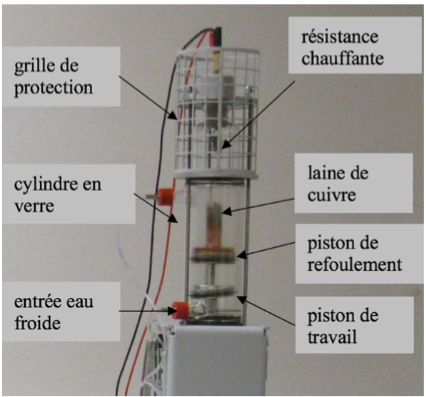

# Introduction

## Contexte et objectif

L’objectif de ce TP est d’étudier le **cycle thermodynamique de Stirling**, en mettant en évidence ses différentes configurations : 

- moteur thermique à combustion externe,
- pompe à chaleur,
- machine frigorifique.

Le banc d’essai permet de visualiser les courbes $P = f(V, T)$, de tracer le **diagramme de Clapeyron** et de déterminer le **rendement des cycles** dans ces différents modes. Ce travail s’inscrit dans le cadre de l’analyse des systèmes thermodynamiques réels et de l’exploitation de leurs performances énergétiques.

## Concepts théoriques clés

Ce TP mobilise plusieurs notions fondamentales de thermodynamique :

- **Cycle de Carnot** : cycle théorique idéal constitué de deux isothermes et deux adiabatiques, au rendement maximal $\eta_C = 1 - \frac{T_2}{T_1}$.
- **Cycle de Stirling** : composé de deux isothermes et deux isochores, il peut approcher le rendement de Carnot si le régénérateur est parfait.
- **Machine thermique** : appareil recevant de la chaleur d’une source chaude pour produire du travail, avec rejet de chaleur vers une source froide.
- **Pompe à chaleur / Machine frigorifique** : fonctionnement inverse d’une machine thermique, avec absorption de chaleur d’une source froide en recevant du travail, pour chauffer une source chaude (pompe à chaleur) ou refroidir (frigo).
- **Rendement / Coefficient de performance (COP)** : indicateurs de performance énergétique.

## Dispositif expérimental

Le dispositif utilisé est un **moteur Stirling** simulé, composé (voir image en Figure \ref{fig:composants}):

- d’un **cylindre en verre** résistant à haute température,
- de **deux pistons** :
  - un **piston de refoulement** (en haut), contenant de la laine de cuivre pour améliorer le rendement,
  - un **piston de travail** (en bas), assurant la production de travail mécanique,
- d’un système de **circulation d’eau** entre deux cylindres (source chaude ou froide selon le mode de fonctionnement),
- d’un **volant d’inertie** qui assure une rotation régulière,
- de **capteurs** (pression et déplacement) connectés à un logiciel d'acquisition (Cassy-Lab2) permettant le tracé du diagramme $P-V$.

La chaleur est fournie par une résistance chauffante dans le mode moteur thermique, ou extraite par circulation d’eau dans les modes frigorifique et pompe à chaleur. Le mouvement des pistons, déphasés de $\pi/2$, permet le passage du gaz entre les zones chaude et froide, assurant ainsi les différentes phases du cycle de Stirling.

{#fig:composants}

## Travail préparatoire

**1. Volume et expressions thermodynamiques du cycle**

- Le volume total du gaz est donné par :
  $$  V = S \cdot s_{B1} + V_0$$
  où :
  - $S$ est la section du piston de travail,
  - $s_{B1}$ est le déplacement du piston,
  - $V_0$ est le volume mort (volume minimal).

À partir du diagramme (figure 5), les transformations sont :

- **1 $\rightarrow$ 2** : compression isotherme à $T_2$
  $$ W_{12} = -nRT_2 \ln\left(\frac{V_2}{V_1}\right), \quad Q_{12} = W_{12}$$

- **2 $\rightarrow$ 3** : chauffage isochore
  $$W_{23} = 0, \quad Q_{23} = nC_V(T_1 - T_2)$$

- **3 $\rightarrow$ 4** : détente isotherme à $T_1$
  $$W_{34} = nRT_1 \ln\left(\frac{V_1}{V_2}\right), \quad Q_{34} = W_{34}$$

- **4 $\rightarrow$ 1** : refroidissement isochore
  $$W_{41} = 0, \quad Q_{41} = nC_V(T_2 - T_1)$$

**Bilan sur le cycle** :
$$W_\text{cycle} = W_{12} + W_{34}$$
$$Q_\text{total} = Q_{12} + Q_{23} + Q_{34} + Q_{41}$$

**Rendement** :
$$\eta = \frac{W_\text{cycle}}{Q_\text{entrant}} = \frac{W_\text{cycle}}{Q_{34} + Q_{23}}$$

---

**2. Cas avec régénérateur idéal**

Si la chaleur isochore est entièrement récupérée et restituée par un régénérateur :
$$Q_{23} + Q_{41} = 0 \quad \Rightarrow \quad Q_\text{entrant} = Q_{34}$$

Donc :
$$\eta = \frac{W_{12} + W_{34}}{Q_{34}} = 1 - \frac{T_2}{T_1}$$

$\rightarrow$ Ce rendement correspond au **rendement de Carnot**.  
**Conclusion** : un Stirling avec régénérateur idéal atteint le rendement maximal théorique.

---

**3. Section du piston et expression de $V$**

Diamètre intérieur du cylindre : $D = 60\ \text{mm} = 0{,}06\ \text{m}$

$$S = \frac{\pi D^2}{4} = \frac{\pi (0{,}06)^2}{4} \approx 2{,}827 \times 10^{-3}\ \text{m}^2$$

Donc :
$$V(s_{B1}) = S \cdot s_{B1} + V_0$$
(à rentrer dans CassyLab2)

---

**4. Vérification dimensionnelle : $pV$**

$$[p] = \text{Pa} = \frac{N}{m^2}, \quad [V] = m^3 \Rightarrow [pV] = \frac{N}{m^2} \cdot m^3 = Nm$$

$\rightarrow$ $pV$ a bien les dimensions d’un **travail**.

---

**5. Travail fourni par un tour**

Le logiciel donne $W$ en $\text{hPa} \cdot \text{cm}^3$.

Conversion :

$$1\ \text{hPa} = 100\ \text{Pa}, \quad 1\ \text{cm}^3 = 10^{-6}\ \text{m}^3$$
$$1\ \text{hPa.cm}^3 = 100 \times 10^{-6} = 10^{-4}\ \text{J} = 0{,}0001\ \text{Nm}$$

---

**6. Puissance fournie**

Si le travail par cycle est $W$, et que le moteur tourne à $f$ tours/sec :

$$P = W \cdot f$$

---

**7. Bilan énergétique par cycle**

- $Q_1$ : chaleur absorbée à $T_1$
- $Q_2$ : chaleur rejetée à $T_2$
- $Q_r$ : chaleur échangée avec régénérateur
- $W$ : travail utile récupéré

$$W = Q_1 + Q_2 + Q_r$$

---

**8. Rendement moteur thermique**

Sans régénérateur :
$$\eta = \frac{W_{34} + W_{12}}{Q_{34} + Q_{23}} < 1$$

Avec régénérateur :
$$\eta = 1 - \frac{T_2}{T_1} = \eta_{\text{Carnot}}$$

---

**9. Fonctionnement pompe à chaleur / machine frigorifique**

- **Machine frigorifique** :
  - objectif : absorber $Q_\text{froid}$, fournir un travail $W$
  - $\text{COP}_\text{frigo} = \frac{Q_\text{froid}}{W}$

- **Pompe à chaleur** :
  - objectif : délivrer $Q_\text{chaud}$
  - $\text{COP}_\text{PAC} = \frac{Q_\text{chaud}}{W}$

La chaleur est échangée par l’air via la laine de cuivre. En inversant le sens du moteur :
- sens horaire : machine frigorifique,
- sens trigonométrique : pompe à chaleur.

La puissance mécanique est :
$$
P = W \cdot f
$$

Pour mesurer la puissance « froide » : utiliser un **thermocouple** pour mesurer le débit thermique extrait par l’air dans la partie froide.

---

**10. Utilisations actuelles du moteur Stirling**

- Générateurs pour satellites (ex : sondes spatiales avec radio-isotopes),
- Cogénération domestique (production combinée de chaleur et d’électricité),
- Systèmes de climatisation / réfrigération,
- Utilisation avec énergies renouvelables (solaire concentré),
- Systèmes silencieux dans des applications militaires ou sous-marines.

# Expériences

# Conclusion

