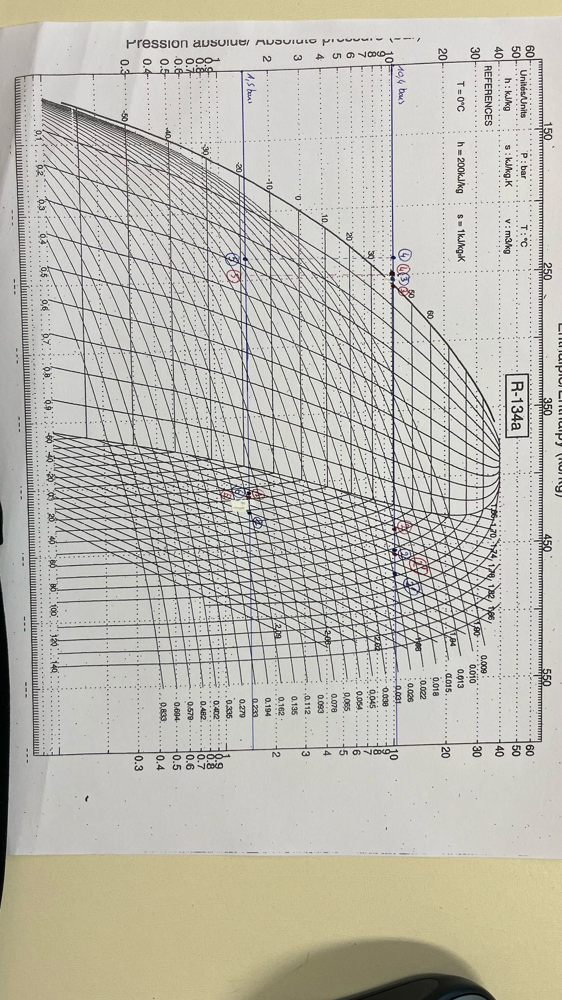
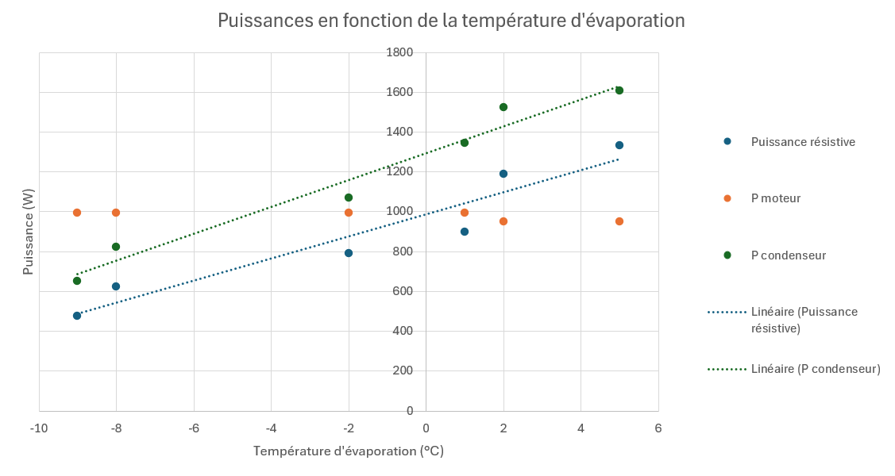
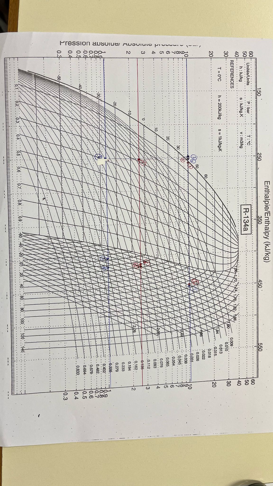

# Introduction

Ce TP porte sur l'étude d'une pompe à chaleur mécanique fonctionnant avec le fluide frigorigène R134a. L'objectif est d'analyser les cycles thermodynamiques théoriques et réels de cette pompe à chaleur à partir de mesures expérimentales de température et de pression. L'influence d'un échangeur de chaleur sur les performances du système sera également évaluée. Le TP permettra de comparer différents régimes de fonctionnement: à température de condensation fixée et à température d'évaporation fixée. L'accent sera mis sur l'analyse des puissances thermiques à l'évaporateur et au condenseur, ainsi que sur les puissances mécaniques et électriques au niveau du compresseur, en fonction des conditions de fonctionnement.

## Concepts théoriques clés

Les principales formules utilisées sont:

- Puissance au condenseur: $Q_{COND} = \dot{m}_{R134a} \cdot (h_2 - h_4)$
- Puissance à l'évaporateur: $Q_{EVAP} = \dot{m}_{R134a} \cdot (h_1 - h_4)$
- Puissance du compresseur: $W_{COMP} = \dot{m}_{R134a} \cdot (h_2 - h_1)$
- Rendement isentropique de compression: $\eta_{isen.} = \frac{(h_2 - h_1)_{isen.}}{(h_2 - h_1)_{rel}}$
- Puissance thermique via bilan enthalpique: $P_{enth} = \dot{m} \cdot c_p \cdot (\Theta_s - \Theta_e)$
- Coefficient de Performance en mode froid: $COP_{f} = \frac{P_{évap}}{P_{comp}}$
- Coefficient de Performance en mode chaud: $COP_{c} = \frac{P_{cond}}{P_{comp}}$
- COP de Carnot en mode froid: $COP_{f,C} = \frac{\Theta_{SF}}{\Theta_{SC} - \Theta_{SF}}$
​​- COP de Carnot en mode chaud: $COP_{c,C} = \frac{\Theta_{SC}}{\Theta_{SC} - \Theta_{SF}}$

## Dispositif expérimental

L'installation expérimentale se compose des éléments suivants:

- Un compresseur alternatif bi-cylindre entraîné par un moteur asynchrone
- Un condenseur à eau avec débit contrôlé et mesuré
- Un évaporateur alimenté par une résistance électrique
- Une vanne de détente réglée pour assurer 5°C de surchauffe en sortie évaporateur
- Un débitmètre pour le fluide R134a en phase liquide
- Un échangeur R134a/R134a optionnel permettant de sous-refroidir le liquide sortie condenseur et de surchauffer la vapeur sortie évaporateur

L'instrumentation comprend:

- 8 thermocouples de type K implantés à différents points du circuit
- Des manomètres haute pression (HP) et basse pression (BP)
- Un voltmètre et un ampèremètre pour mesurer les puissances électriques
- Un tachymètre pour déterminer le facteur de puissance du moteur électrique
- Une vanne trois voies permettant de faire fonctionner le système avec ou sans l'échangeur de chaleur

Cette installation permet d'étudier deux modes de fonctionnement principaux:

- En mode réfrigérateur: variation de la température d'évaporation à température de condensation fixe
-En mode pompe à chaleur: variation de la température de condensation à température d'évaporation fixe

## Travail préparatoire

### Courbe de saturation et isobare Pabs = 8 bars

Sur le diagramme de phase fourni, la courbe de saturation délimite trois domaines :

- **À gauche** : la zone liquide (fluide totalement condensé).
- **Entre les courbes** : la zone diphasique (mélange liquide + vapeur).
- **À droite** : la zone vapeur (fluide entièrement vaporisé).

Voir Figure \ref{fig:prepa} en annexe pour le tracé de l'isobare.

À cette pression, la température de changement d’état du R134a (température de saturation) est environ **31°C**.

**Conclusion** :  
Dans la zone liquide proche de la saturation, les isothermes sont presque **verticales** : la température varie très peu malgré une variation de l'enthalpie.

### État du R134a à Prel = 0,7 bar et 20°C

La pression relative donnée est **Prel = 0,7 bar**, soit une pression absolue de :

$P_{\text{abs}} = 0,7 + 1,013 = 1,713 \, \text{bars}$

À **20°C** et **1,713 bars**, d’après le diagramme (ou interpolations des tables), le R134a est **en phase vapeur surchauffée**.

L'enthalpie spécifique correspondante est environ :

$h \approx 410 \, \text{kJ/kg}$

Voir Figure \ref{fig:prepa} en annexe pour l'explication de la lecture graphique.

### Expression littérale des coefficients de performance (COP)

**D’après le Tableau 1 :**

- **COP frigorifique théorique (diagramme)** :

$COP_{f, \, diag} = \frac{P_{\text{évap}}}{P_{\text{comp}}}$

- **COP pompe à chaleur théorique (diagramme)** :

$COP_{c, \, diag} = \frac{P_{\text{cond}}}{P_{\text{comp}}}$

- **COP frigorifique expérimental** :
  
$COP_{f, \, TP} = \frac{P_{\text{résistance}}}{P_{\text{élec,moteur}}}$

- **COP pompe à chaleur expérimental** :
  
$COP_{c, \, TP} = \frac{P_{\text{cond}}}{P_{\text{élec,moteur}}}$

- **COP idéal de Carnot (froid)** :
  
$COP_{f, \, Carnot} = \frac{T_{\text{source froide}}}{T_{\text{source chaude}} - T_{\text{source froide}}}$

- **COP idéal de Carnot (chaud)** :
  
$COP_{c, \, Carnot} = \frac{T_{\text{source chaude}}}{T_{\text{source chaude}} - T_{\text{source froide}}}$

### Paramètres influençant les COP

**Paramètres thermodynamiques** :

- Température de condensation (**$T_{source chaude}$**) et température d’évaporation (**$T_{source froide}**) : plus l’écart est faible, meilleur est le COP.
- Pressions HP/BP qui influent sur les températures correspondantes.

**Paramètres thermiques** :

- Qualité des échangeurs (efficacité de la condensation et de l'évaporation).
- Taux de surchauffe ou de sous-refroidissement.

**Paramètres électriques** :

- Rendement du moteur électrique ($cos(\Phi)$).
- Pertes électriques dans les résistances ou moteurs auxiliaires.

**Remarque** :  

Les COP expérimentaux sont souvent inférieurs aux COP théoriques en raison des irréversibilités (pertes thermiques, pertes mécaniques, rendement du moteur imparfait...).

# Expériences

## Exploitation des mesures des deux premiers essais 

### Calcul de rendement isentropique

Dans cette première partie, l'expérience vise à analyser l'influence d'un échangeur sur le cycle 
thermodynamique et les coefficients de performance. Pour cela, les deux pressions absolues sont fixées à $P_{cond} = 
11$ bars et $P_{évap} = 2,5$ bars. Les relevés sont effectués dans deux configurations : avec et sans l'utilisation 
de l'échangeur. Ces données permettent ensuite de tracer les cycles thermodynamiques sur le diagramme [Log(P)-h].

{#fig:exp1}

\newpage

On mesure, grâce au diagramme les valeurs des enthalpies : 

**Avec échangeur**

$h_1 = 430 KJ/Kg$
$h_2 = 458 KJ/Kg$
$h_2^{is} = 474 KJ/Kg$

**Sans échangeur**

$h_1 = 418 KJ/Kg$
$h_2 = 442 KJ/Kg$
$h_2^{is} =  462 KJ/Kg$

Le rendement isentropique se calcule : $\eta = \frac{h_2^{s}-h_1}{h_2 - h_1}$

On obtient donc un rendement isentropique :

- Avec échangeur : $\eta_{is} = 1,57$
- Sans échangeur : $\eta_{is} = 1,83$

Ces valeurs sont incorrectes car la situation réelle n’est pas isentropique. Par ailleurs, la présence de pertes thermiques dans le cycle empêche d’atteindre un rendement supérieur à 1, ce qui confirme que les rendements calculés sont erronés. Cette erreur provient principalement des pertes de chaleur au niveau du compresseur, lesquelles ne peuvent pas être quantifiées avec notre instrumentation actuelle. Cela peut donc entraîner des résultats non représentatifs de la réalité.

### Calcul des puissances

On utilise les formules suivantes :

- Puissance au condenseur: $Q_{COND} = \dot{m}_{R134a} \cdot (h_2 - h_4)$
- Puissance à l'évaporateur: $Q_{EVAP} = \dot{m}_{R134a} \cdot (h_1 - h_4)$
- Puissance du compresseur: $W_{COMP} = \dot{m}_{R134a} \cdot (h_2 - h_1)$

**Avec échangeur :**

- Puissance au condenseur: $Q_{COND} = 1221 W$
- Puissance à l'évaporateur: $Q_{EVAP} = 1078 W$
- Puissance du compresseur: $W_{COMP} = 143W$

**Sans échangeur :**

- Puissance au condenseur: $Q_{COND} = 1034 W$
- Puissance à l'évaporateur: $Q_{EVAP} = 913 W$
- Puissance du compresseur: $W_{COMP} = 121 W$

Dans les deux cas on a bien $Q_{COND} = Q_{EVAP} + W_{COMP}$

### Calcul des COP Frigo et PAC

Les formules pour les COP sont :

$COP_{f} = \frac{P_{évap}}{P_{comp}}$ et $COP_{PAC} = \frac{P_{cond}}{P_{comp}}$

**Avec échangeur :**

$COP_{f} = 7,53$ et $COP_{PAC} = 8,53$

**Sans échangeur :**

$COP_{f} = 7,54$ et $COP_{PAC} = 8,54$

Le Coefficient de Performance (COP) évalue l’efficacité d’une machine thermique en comparant l’énergie thermique produite ou transférée à l’énergie consommée. Plus le COP est élevé, plus la machine est performante, car elle fournit davantage d’énergie thermique pour une même quantité d’énergie utilisée. Par exemple, un climatiseur avec un COP de 6 transfère 6 unités de chaleur pour chaque unité d’électricité consommée. Un COP élevé se traduit donc par une meilleure efficacité énergétique, des économies sur les coûts de fonctionnement et un impact environnemental réduit.

### Puissances expérimentales obtenues

Puissance électrique : $P_{moteur} = U \cdot I \cdot cos(\Phi)$ avec $cos(\Phi) = 0,96$
Puissance résistive : $P_{res} = U_{res} \cdot I_{res}$
Puissance thermique via bilan enthalpique: $P_{condenseur} = \dot{m} \cdot c_p \cdot (\Theta_s - \Theta_e)$

$$ \Rightarrow P_{moteur} = 992,64 W$$
$$ \text{Sans échangeur : }  P_{res} = 752,5 W, \text{ Avec échangeur :} P_{res} = 851 W$$
$$ \text{Sans échangeur : }  P_{condenseur} = 1398,8 W, \text{ Avec échangeur : }P_{consenseur} = 1307,5 W$$

### Comparaison avec les puissances théoriques

| Type de puissance                      | Avec échangeur (W) | Sans échangeur (W) |
|----------------------------------------|---------------------|---------------------|
| **Puissance au condenseur (théorique)**| 1221                | 1034                |
| **Puissance à l’évaporateur (théorique)**| 1078              | 913                |
| **Puissance du compresseur (théorique)**| 143              | 121                 |
| **Puissance moteur (exp.)**            | 992,64              | 992,64              |
| **Puissance résistive (exp.)**         | 851                 | 752,5               |
| **Puissance au condenseur (exp.)**| 1307,5           | 1398,8              |

### Calcul des COP Frigo et PAC

Les formules pour les COP sont :

$COP_{f} = \frac{P_{res}}{P_{moteur}}$ et $COP_{PAC} = \frac{P_{cond}}{P_{moteur}}$

**Avec échangeur :**

$COP_{f} = 0,85$ et $COP_{PAC} = 1,31$

**Sans échangeur :**

$COP_{f} = 0,75$ et $COP_{PAC} = 1,41$

### Rendement global du compresseur

Le rendement global du compresseur est $\eta = \frac{P_{condenseur}- P_{evap}}{P_{res}}$

**Avec échangeur :**

$\eta = 16,7 \text{ pourcents}$

**Sans échangeur :**

$\eta = 16 \text{ pourcents}$

### Conclusion

L'ajout de l’échangeur améliore légèrement les puissances théoriques et le rendement global du compresseur (16,7 % contre 16 %), mais son impact sur les COP reste négligeable, voire légèrement défavorable expérimentalement. Ces écarts limités s’expliquent par les pertes thermiques et les incertitudes de mesure. L’échangeur optimise donc marginalement le cycle, sans apporter de gain significatif dans les conditions étudiées.

## Fonctionnement frigo

### Tracé des cycles

Voir annexe

### Calcul des différentes puissances 

| Essai | $P_{res}$ (W) | $P_{moteur}$ (W) | $P_{condenseur}$ (W) |
|-------|---------------------|-------------------------|-----------------------------|
| 1     |    476              |    992,64               |         652,8               |
| 2     |   624               |       992,64            |              823            |
| 3     |      792            |      992,64             |       1069                  |
| 4     |      900            |          992,64         |        1344                 |
| 5     |      1188           |          949,44     |            1522             |
| 6     |       1334          |          949,44    |          1606               |

On remarque que :

- $P_{res}$ augmente à chaque essai : la chaleur apportée à l’évaporateur est de plus en plus grande.

- $P_{moteur}$ reste stable puis diminue légèrement : le compresseur travaille un peu moins quand la température d’évaporation monte.

- $P_{condenseur}$ suit la hausse de $P_{res}$, ce qui est logique : plus de chaleur absorbée = plus de chaleur à rejeter.

Globalement, les puissances sont cohérentes avec le fonctionnement d’un cycle frigorifique.

### Puissances en fonction de la température d'évaporation

{#fig:puissances}

$P_{res}$ (bleu) et $P_{condenseur}$ (vert) augmentent linéairement avec la température d'évaporation, ce qui est cohérent : plus l'évaporateur est chaud, plus il peut absorber et rejeter de chaleur.

$P_{moteur}$ (orange) reste globalement constante, avec une légère baisse : le compresseur fournit un effort presque stable, voire un peu réduit lorsque la température d'évaporation monte.

Les tendances linéaires montrent bien l'évolution énergétique du système en fonction des conditions de fonctionnement.

\newpage

# Conclusion

Ce TP a permis d’analyser le fonctionnement d’une pompe à chaleur utilisant du R134a, en étudiant ses cycles thermodynamiques dans différentes configurations. L’ajout d’un échangeur de chaleur a légèrement amélioré les performances théoriques, notamment au niveau du rendement global du compresseur, mais n’a pas significativement augmenté les COP expérimentaux. Les écarts observés entre les performances théoriques et expérimentales s’expliquent par les pertes thermiques, les irrégularités du compresseur et les limites de l’instrumentation.

L’étude des puissances et COP en fonction de la température d’évaporation montre une nette augmentation des puissances thermique et électrique, traduisant une adaptation du système aux conditions de fonctionnement. Au final, le TP met en évidence les différences entre performances idéales et réelles, et souligne l’importance des conditions de fonctionnement et des pertes dans l’évaluation des machines thermiques.

# Annexes

{#fig:prepa}

{#fig:exp2}
