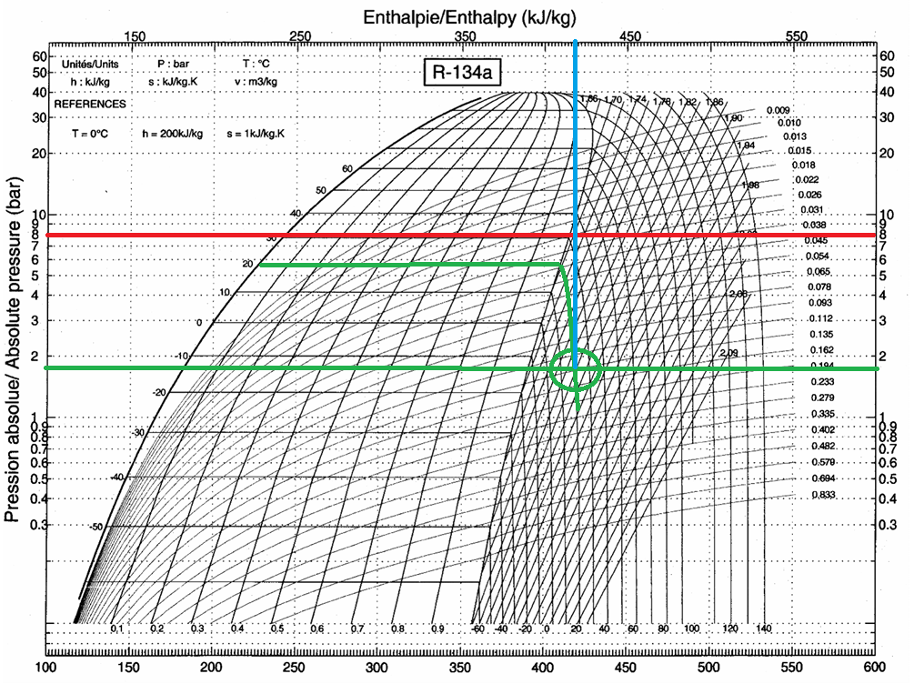

# Introduction

Ce TP porte sur l'étude d'une pompe à chaleur mécanique fonctionnant avec le fluide frigorigène R134a. L'objectif est d'analyser les cycles thermodynamiques théoriques et réels de cette pompe à chaleur à partir de mesures expérimentales de température et de pression. L'influence d'un échangeur de chaleur sur les performances du système sera également évaluée. Le TP permettra de comparer différents régimes de fonctionnement: à température de condensation fixée et à température d'évaporation fixée. L'accent sera mis sur l'analyse des puissances thermiques à l'évaporateur et au condenseur, ainsi que sur les puissances mécaniques et électriques au niveau du compresseur, en fonction des conditions de fonctionnement.

## Concepts théoriques clés

Les principales formules utilisées sont:

- Puissance au condenseur: $Q_{COND} = \dot{m}_{R134a} \cdot (h_2 - h_4)$
- Puissance à l'évaporateur: $Q_{EVAP} = \dot{m}_{R134a} \cdot (h_1 - h_4)$
- Puissance du compresseur: $W_{COMP} = \dot{m}_{R134a} \cdot (h_2 - h_1)$
- Rendement isentropique de compression: $\eta_{isen.} = \frac{(h_2 - h_1)_{isen.}}{(h_2 - h_1)_{rel}}$
- Puissance thermique via bilan enthalpique: $P_{enth} = \dot{m} \cdot c_p \cdot (\Theta_s - \Theta_e)$
- Coefficient de Performance en mode froid: $COP_{f} = \frac{P_{évap}}{P_{comp}}$
- Coefficient de Performance en mode chaud: $COP_{c} = \frac{P_{cond}}{P_{comp}}$
- COP de Carnot en mode froid: $COP_{f,C} = \frac{\Theta_{SF}}{\Theta_{SC} - \Theta_{SF}}$
​​- COP de Carnot en mode chaud: $COP_{c,C} = \frac{\Theta_{SC}}{\Theta_{SC} - \Theta_{SF}}$

## Dispositif expérimental

L'installation expérimentale se compose des éléments suivants:

- Un compresseur alternatif bi-cylindre entraîné par un moteur asynchrone
- Un condenseur à eau avec débit contrôlé et mesuré
- Un évaporateur alimenté par une résistance électrique
- Une vanne de détente réglée pour assurer 5°C de surchauffe en sortie évaporateur
- Un débitmètre pour le fluide R134a en phase liquide
- Un échangeur R134a/R134a optionnel permettant de sous-refroidir le liquide sortie condenseur et de surchauffer la vapeur sortie évaporateur

L'instrumentation comprend:

- 8 thermocouples de type K implantés à différents points du circuit
- Des manomètres haute pression (HP) et basse pression (BP)
- Un voltmètre et un ampèremètre pour mesurer les puissances électriques
- Un tachymètre pour déterminer le facteur de puissance du moteur électrique
- Une vanne trois voies permettant de faire fonctionner le système avec ou sans l'échangeur de chaleur

Cette installation permet d'étudier deux modes de fonctionnement principaux:

- En mode réfrigérateur: variation de la température d'évaporation à température de condensation fixe
-En mode pompe à chaleur: variation de la température de condensation à température d'évaporation fixe

## Travail préparatoire

### Courbe de saturation et isobare Pabs = 8 bars

Sur le diagramme de phase fourni, la courbe de saturation délimite trois domaines :

- **À gauche** : la zone liquide (fluide totalement condensé).
- **Entre les courbes** : la zone diphasique (mélange liquide + vapeur).
- **À droite** : la zone vapeur (fluide entièrement vaporisé).

Voir Figure \ref{fig:prepa} en annexe pour le tracé de l'isobare.

À cette pression, la température de changement d’état du R134a (température de saturation) est environ **31°C**.

**Conclusion** :  
Dans la zone liquide proche de la saturation, les isothermes sont presque **verticales** : la température varie très peu malgré une variation de l'enthalpie.

### État du R134a à Prel = 0,7 bar et 20°C

La pression relative donnée est **Prel = 0,7 bar**, soit une pression absolue de :

$P_{\text{abs}} = 0,7 + 1,013 = 1,713 \, \text{bars}$

À **20°C** et **1,713 bars**, d’après le diagramme (ou interpolations des tables), le R134a est **en phase vapeur surchauffée**.

L'enthalpie spécifique correspondante est environ :

$h \approx 410 \, \text{kJ/kg}$

Voir Figure \ref{fig:prepa} en annexe pour l'explication de la lecture graphique.

### Expression littérale des coefficients de performance (COP)

**D’après le Tableau 1 :**

- **COP frigorifique théorique (diagramme)** :

$COP_{f, \, diag} = \frac{P_{\text{évap}}}{P_{\text{comp}}}$

- **COP pompe à chaleur théorique (diagramme)** :

$COP_{c, \, diag} = \frac{P_{\text{cond}}}{P_{\text{comp}}}$

- **COP frigorifique expérimental** :
  
$COP_{f, \, TP} = \frac{P_{\text{résistance}}}{P_{\text{élec,moteur}}}$

- **COP pompe à chaleur expérimental** :
  
$COP_{c, \, TP} = \frac{P_{\text{cond}}}{P_{\text{élec,moteur}}}$

- **COP idéal de Carnot (froid)** :
  
$COP_{f, \, Carnot} = \frac{T_{\text{source froide}}}{T_{\text{source chaude}} - T_{\text{source froide}}}$

- **COP idéal de Carnot (chaud)** :
  
$COP_{c, \, Carnot} = \frac{T_{\text{source chaude}}}{T_{\text{source chaude}} - T_{\text{source froide}}}$

### Paramètres influençant les COP

**Paramètres thermodynamiques** :

- Température de condensation (**$T_{source chaude}$**) et température d’évaporation (**$T_{source froide}**) : plus l’écart est faible, meilleur est le COP.
- Pressions HP/BP qui influent sur les températures correspondantes.

**Paramètres thermiques** :

- Qualité des échangeurs (efficacité de la condensation et de l'évaporation).
- Taux de surchauffe ou de sous-refroidissement.

**Paramètres électriques** :

- Rendement du moteur électrique ($cos(\Phi)$).
- Pertes électriques dans les résistances ou moteurs auxiliaires.

**Remarque** :  

Les COP expérimentaux sont souvent inférieurs aux COP théoriques en raison des irréversibilités (pertes thermiques, pertes mécaniques, rendement du moteur imparfait...).

# Expériences

# Conclusion

# Annexe

{#fig:prepa}
