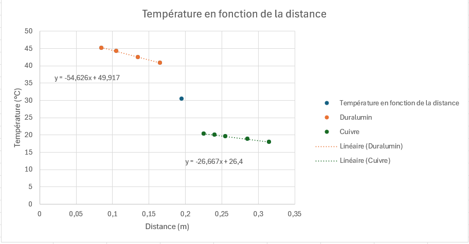
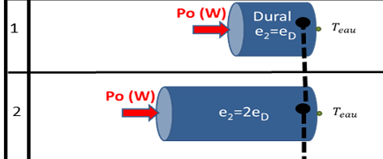
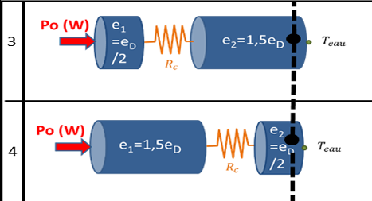
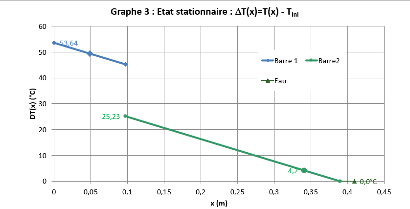
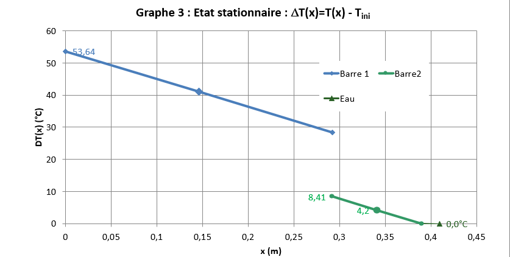
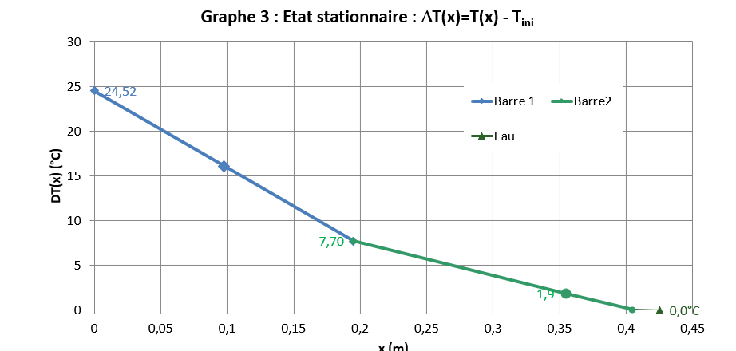
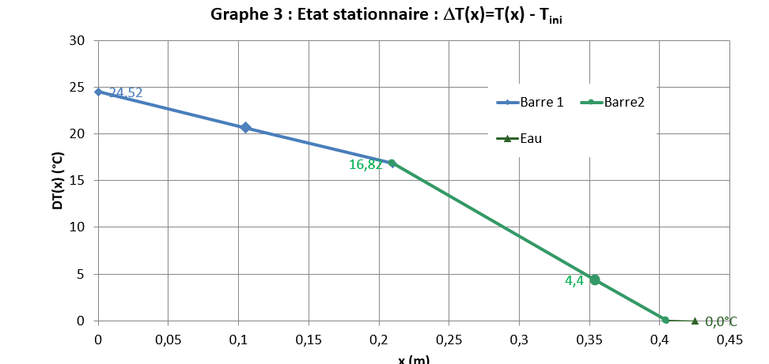

# Préambule

## Introduction

Ce TP a pour objectif d'explorer les mécanismes de conduction thermique dans une configuration monodimensionnelle, à travers l'étude expérimentale de barres métalliques en contact. 

En régime stationnaire, il s'agit de mesurer la conductivité thermique de deux métaux, tandis qu'en régime instationnaire, le temps diffusif et les dynamiques de stabilisation thermique sont examinés. L'utilisation de l'analogie électrique-thermique permet d'introduire des concepts clés comme la résistance thermique et la capacitance thermique. 

À l'aide d'un dispositif instrumenté de thermocouples et d'une acquisition informatique, les températures et flux thermiques sont mesurés pour comprendre les phénomènes en jeu. Ce TP fournit ainsi une première approche complète des transferts de chaleur dans des systèmes simples mais représentatifs.

## Notions clés

### Calorimétrie et énergie interne stockée
- Énergie interne stockée :  
  $E_{stock}$ = $mC_{p}$ ($T_{fin}$ - $T_{ini}$) = $\rho$ $C_{p}$ V ($T_{fin}$ - $T_{ini}$)

  où :
  - $C_{p}$  : chaleur spécifique (J/kg·K).
  - $\rho$ : masse volumique (kg/m³).
  - _V_ : volume (m³).

- Puissance stockée dans un fluide en écoulement :  
   $P_{fluide}$ = $\dot{m}C_{p}$ ($T_{sortie}$ - $T_{entrée}$)  
  où $\dot{m}$ = $\rho q$ (kg/s).

---

### Loi de Fourier
- Flux d'énergie interne en conduction thermique :  $\Phi_{x}$ = -k S $\frac{dT}{dx}$
 - $\Phi_{x}$ : flux (W).
  - $k$ : conductivité thermique (W/m·K).
  - $S$ : section (m²).
  - $\phi_{x} = \frac{\Phi_{x}}{S}$ : densité de flux (W/m²).

---

## Travail préparatoire
Réalisé sur Amétice

Notions importantes abordées :

# Travail à effectuer 

## A l'arrivée en séance

Lors de cette séance, nous avons tout d'abord vérifié que le régime était stationnaire, en nous assurant que les températures et les puissances mesurées étaient constantes.

Les données suivantes ont été relevées : 
- La tension _U_ et le courant _I_ aux bornes du collier chauffant : 65V et 171,8mA.
- La puissance _P_ = _U*I_ = 11,17 _Watts_
- Le débit volumique d'eau dans la boîte à eau : 10 L/h
- Les températures de l'eau à l'entrée et à la sortie de la boîte, via le logiciel : 11,6 °C en entrée et 12,1 °C en sortie.

Ensuite, les températures relevées par les 10 thermocouples positionnés entre le collier chauffant et la boîte à eau ont été enregistrées. 

|Thermocouple n°	|Température (°C)|	Distance (cm)|
|--------|-------|--------|
|1	|45,2 |	8,5 | 
|2	|44,3	|10,5|
|3	|42,5|	13,5|
|4	|40,9	|16,5|
|5	|30,5	|19,5|
|6	|20,4	|22,5|
|7	|20	|24|
|8	|19,6|	25,5|
|9	|18,8|	28,5|
|10	|18|	31,5|

Une fois la phase instationnaire initiée la tension d'alimentation du collier chauffant est augmentée de 65V à 110V, tout en prenant note de l'heure de ce changement, ce moment est l'instant initial de la phase instationnaire.

## Régime instationnaire - Simulations

Pour passer en régime instationnaire, la tension de l'alimentation du collier chauffant est augmentée, cela va donc produire une variation de température du collier. 

Les mesures sont donc effectuées à partir de cet instant pour voir l'évolution de la température dans les matériaux en fonction du temps.

TODO : phrase pour parler de conductivité
On parle de conductivité thermique

Les données suivantes ont été relevées :
- Instant initial de la phase instationnaire : 14h44
- La tension _U_ et le courant _I_ aux bornes du collier chauffant : 110V et 290,2 mA
- La puissance _P_ =_UI_ = 31,9 _Watts_
- Le débit volumique d'eau dans la boîte à eau : 10 L/h
- Les températures de l'eau à l'entrée et à la sortie de la boîte, via le logiciel : 11,6 °C en entrée et 12,1 °C en sortie.

Proportionnalité apparente :
tstab​ semble proportionnel à (RC)tot(RC)tot​. Par exemple :

### Simulations 1 et 2

_Etude de l'influence de la longueur sur le temps de diffusion_

$T_{diff}$ = $RC_{tot}$ donc la capacité du circuit et la résistance est équivalente à un circuit RC électrique.

Dans ces simulations, la relation entre longueur de la barre et le temps de stabilisation est liée, en effet, plus la barre est longue, plus le temps de stabilisation est long. 

Cela est lié au fait que la longueur a doublé et que la diffusivité thermique s'exprime par la dérivée seconde de la distance (donc x²) d'où le facteur 4 =2² car la longueur est doublée ici.

De plus, la longueur de la barre influe sur sa capacité à stocker l'énergie car plus le temps de stabilisation est long, plus la barre a la possibilité de stocker de l'énergie.

TODO : relire au dessus ?

### Simulations 3 et 4

_Influence des contacts imparfaits :_

Les cas 3 et 4 montrent l'effet d'un contact imparfait sur $t_{stab}$​. Quand le contact imparfait est proche de la source (cas 3), $t_{stab}$​ est légèrement plus court que dans le cas où le contact est éloigné (cas 4). Cela montre que la position du contact influence la dynamique thermique.

La résistance de contact influence donc le temps de stabilisation car cette résistance représente le gap de température entre les deux parties du matériau.

TODO : légende

TODO : légende

Dans la simulation 4, il est observable que la température est plus élevée plus longtemps donc le matériau stocke plus d'énergie et le temps de stabilisation est plus long.

### Simulations 5 et 6

_Configuration des matériaux :_

Les cas 5 et 6 (position de différents matériaux) montrent une réduction significative de $t_{stab}$​ par rapport à $RC_{tot}$​. Cela pourrait être dû à une amélioration de la conduction thermique lorsque les matériaux sont bien positionnés.

TODO légende et expliquer disposition de chaque matériau

Cette différence s'explique car le cuivre est plus conducteur que le dularumin, donc la température entre le gap est plus élevée avant donc permet un meilleur stock d'énergie.

### Simulation du TP (Simulation 7)

Dans la configuration du TP, avec une résistance convective en bout de barre, $RC_{tot}$​ est augmentée, et $t_{stab}$​ est également plus long par rapport aux configurations sans convection (comme cas 5).

$RC_{tot}$ est plus élevée que dans la simulation 5 car il y a la résistance de contact qui s'ajoute entre les deux matériaux. Le temps de stabilisation est donc plus long et l'énergie stockée supérieure par rapport à la simulation 5 sans résistance de contact.

#### Comparaison avec les résultats expérimentaux

Nous avons un temps de stabilisation d'environ 7560 secondes lors de notre expérience, différent des 7200 secondes théoriques de la simulation 7. Cette différence peut s'expliquer par les pertes thermiques avec l'environnement bien que la barre soit isolée avec de l'isolant fibreux.
De plus, l'incertitude de lecture sur le logiciel est en partie responsable de ce décalage.

### Résumé des simulations

Il est possible de remarquer que $t_{stab}$​ dépend fortement de $RC_{tot}$​, mais également des facteurs tels que les contacts imparfaits, la position des matériaux. Les conditions aux limites (résistance convective) peuvent modifier la relation linéaire simple. Cela illustre l'importance des paramètres thermiques globaux pour prédire le temps nécessaire à atteindre l'équilibre.

## Régime stationnaire - Exploitation des mesures 

TODO numéroter les questions 

Les données suivantes ont été relevées : 
- La tension _U_ et le courant _I_ aux bornes du collier chauffant : 65V et 171,8mA.
- Le débit volumique d'eau dans la boîte à eau : 10 L/h
- Les températures de l'eau à l'entrée et à la sortie de la boîte, via le logiciel : 11,6 °C en entrée et 12,1 °C en sortie.
- La puissance $P_{0}$ = _U*I_ = 11,17 _Watts_ dissipés par la résistance chauffante en début de barre
- La puissance thermique $P_{eau}$ perdue par la barre se calcule :

TODO : exposant

$P_{fluide}$ = $\dot{m}C_{p}$ ($T_{sortie}$ - $T_{entrée}$) = 2,78*10^(-6)x4185(12,1-11,6) = 4,7*10^-3 _Watts_

TODO : trouver ca

- Il y a une différence entre $P_{0}$ et $P_{eau}$ car 
La puissance qui à réellement traversé la barre est donc 

Ensuite, les températures relevées par les 10 thermocouples positionnés entre le collier chauffant et la boîte à eau ont été enregistrées. 

|Thermocouple n°	|Température (°C)|	Distance (cm)|
|--------|-------|--------|
|1	|45,2 |	8,5 | 
|2	|44,3	|10,5|
|3	|42,5|	13,5|
|4	|40,9	|16,5|
|5	|30,5	|19,5|
|6	|20,4	|22,5|
|7	|20	|24|
|8	|19,6|	25,5|
|9	|18,8|	28,5|
|10	|18|	31,5|

TODO : légende

Les valeurs des températures des jonctions valent dont 

- L'absence de pertes latérales signifie que la chaleur se propage uniquement dans le sens longitudinal (le long de la barre) sans dissipation significative dans l'environnement. Si cette hypothèse est valide, on devrait observer une décroissance linéaire de la température en fonction de la distance, ce qui semble être notre cas , comme en témoignent les tendances linéaires des deux courbes.

- Le matériau le plus conducteur est le cuivre car sa pente de température en fonction de la distance est moins élevée. Cela signifie que le cuivre conduit mieux la chaleur que le duralumin car sa température reste plus élevée sur une plus grande distance.

TODO a partir de la question 6 incluse