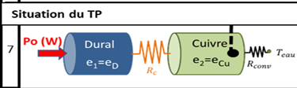
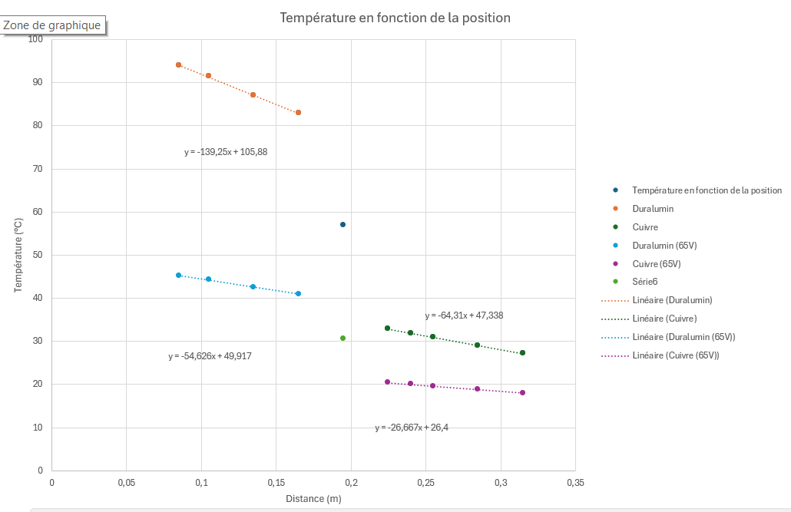

# Préambule

## Introduction

Ce TP a pour objectif d'explorer les mécanismes de conduction thermique dans une configuration monodimensionnelle, à travers l'étude expérimentale de barres métalliques en contact. 

En régime stationnaire, il s'agit de mesurer la conductivité thermique de deux métaux, tandis qu'en régime instationnaire, le temps diffusif et les dynamiques de stabilisation thermique sont examinés. L'utilisation de l'analogie électrique-thermique permet d'introduire des concepts clés comme la résistance thermique et la capacitance thermique. 

À l'aide d'un dispositif instrumenté de thermocouples et d'une acquisition informatique, les températures et flux thermiques sont mesurés pour comprendre les phénomènes en jeu. Ce TP fournit ainsi une première approche complète des transferts de chaleur dans des systèmes simples mais représentatifs.

## Notions clés

### Calorimétrie et énergie interne stockée
- Énergie interne stockée :  
  $E_{stock}$ = $mC_{p}$ ($T_{fin}$ - $T_{ini}$) = $\rho$ $C_{p}$ V ($T_{fin}$ - $T_{ini}$)

  où :
  - $C_{p}$  : chaleur spécifique (J/kg·K).
  - $\rho$ : masse volumique (kg/m³).
  - _V_ : volume (m³).

- Puissance stockée dans un fluide en écoulement :  
   $P_{fluide}$ = $mC_{p}$ ($T_{sortie}$ - $T_{entrée}$)  
  où ${m}$ = $\rho q$ (kg/s).

---

### Loi de Fourier
- Flux d'énergie interne en conduction thermique :  $\Phi_{x}$ = -k S $\frac{dT}{dx}$
 - $\Phi_{x}$ : flux (W).
  - $k$ : conductivité thermique (W/m·K).
  - $S$ : section (m²).
  - $\phi_{x} = \frac{\Phi_{x}}{S}$ : densité de flux (W/m²).

---

## Travail préparatoire
Réalisé sur Amétice

Notions importantes abordées :

# Travail à effectuer 

## A l'arrivée en séance

Lors de cette séance, nous avons tout d'abord vérifié que le régime était stationnaire, en nous assurant que les températures et les puissances mesurées étaient constantes.

Les données suivantes ont été relevées : 
- La tension _U_ et le courant _I_ aux bornes du collier chauffant : 65V et 171,8mA.
- La puissance _P_ = _U*I_ = 11,17 _Watts_
- Le débit volumique d'eau dans la boîte à eau : 10 L/h
- Les températures de l'eau à l'entrée et à la sortie de la boîte, via le logiciel : 11,6 °C en entrée et 12,1 °C en sortie.

Ensuite, les températures relevées par les 10 thermocouples positionnés entre le collier chauffant et la boîte à eau ont été enregistrées. 

|Thermocouple n°	|Température (°C)|	Distance (cm)|
|--------|-------|--------|
|1	|45,2 |	8,5 | 
|2	|44,3	|10,5|
|3	|42,5|	13,5|
|4	|40,9	|16,5|
|5	|30,5	|19,5|
|6	|20,4	|22,5|
|7	|20	|24|
|8	|19,6|	25,5|
|9	|18,8|	28,5|
|10	|18|	31,5|

Une fois la phase instationnaire initiée la tension d'alimentation du collier chauffant est augmentée de 65V à 110V, tout en prenant note de l'heure de ce changement, ce moment est l'instant initial de la phase instationnaire.

## Régime instationnaire - Simulations

Pour passer en régime instationnaire, la tension de l'alimentation du collier 
chauffant est augmentée, cela va donc produire une variation de température
du collier qui va chauffer les barres des deux matériaux. 

Les mesures sont donc effectuées à partir de cet instant pour voir l'évolution 
de la température dans les matériaux en fonction du temps.

Les données suivantes ont été relevées :
- Instant initial de la phase instationnaire : 14h44
- La tension _U_ et le courant _I_ aux bornes du collier chauffant : 110V et 290,2 mA
- La puissance _P_ =_UI_ = 31,9 _Watts_
- Le débit volumique d'eau dans la boîte à eau : 10 L/h
- Les températures de l'eau à l'entrée et à la sortie de la boîte, via le logiciel : 11,6 °C en entrée et 12,1 °C en sortie.

_NB : Les mesures de chaque simulation sont disponibles à la fin du compte rendu_

### Simulations 1 et 2

_Etude de l'influence de la longueur sur le temps de diffusion_

*Figure 1 : Simulations 1 et 2 - Variation de la longueur d'un même matériau.*

Dans ce cas $T_{diff}$ = $RC_{tot}$ donc la capacité du circuit et la résistance est 
équivalente à un circuit RC électrique.

Dans ces simulations, la relation entre longueur de la barre et le temps de 
stabilisation est liée, en effet, plus la barre est longue, plus le temps de 
stabilisation est long. 

Cela s'explique par le fait que la longueur a doublé et que la diffusivité thermique 
s'exprime par la dérivée seconde de la distance (donc x²) d'où le facteur 4 =2² car la longueur est doublée ici.

De plus, la longueur de la barre influe sur sa capacité à stocker
l'énergie car plus le temps de stabilisation est long, plus la barre a 
la possibilité de stocker de l'énergie.

### Simulations 3 et 4

_Influence des contacts imparfaits :_

*Figure 2 : Représentation des contacts non parfaits entre deux parties par une résistance de contact $R_{c}$*

Les cas 3 et 4 montrent l'effet d'un contact imparfait sur $t_{stab}$​. 
Quand le contact imparfait est proche de la source (cas 3), $t_{stab}$​ est légèrement 
plus court que dans le cas où le contact est éloigné (cas 4).
_(Rappel : les données des simulations sont disponibles en fin de compte rendu)_

Cela montre que la position du contact influence la dynamique thermique.

La résistance de contact influence donc le temps de stabilisation car cette
résistance représente le gap de température entre les deux parties du matériau.

Ce gap peut s'observer lors du tracé de _T(x)_, température en fonction de la position.

*Figure 3 : Duralumin séparé en deux parties non égales avec un contact imparfait (simulation 3)*

*Figure 4 : Duralumin séparé en deux parties non égales avec un contact imparfait (simulation 4)*

Dans la simulation 4, il est observable que la température est plus élevée plus 
longtemps donc le matériau stocke plus d'énergie et le temps de stabilisation 
est plus long.

$T_{stab3}$ = 5480 secondes et $T_{stab4}$ = 8000 secondes

### Simulations 5 et 6

_Configuration des matériaux :_

Les cas 5 et 6 (position de différents matériaux) montrent une réduction 
significative de $t_{stab}$​ par rapport à $RC_{tot}$​. 
Cela pourrait être dû à une amélioration de la conduction thermique 
lorsque les matériaux sont bien positionnés.

*Simulation 5 : Le duralumin est placé en premier*

*Figure 5 - Simulation 5 : Contact parfait entre les deux matériaux, $R_{c}$ = 0*

*Simulation 6 : Le cuivre est placé en premier*

*Figure 6 - Simulation 6 : Contact parfait entre les deux matériaux, $R_{c}$ = 0*

Cette réduction significative de $t_{stab}$​ par rapport à $RC_{tot}$ s'explique
par le fait que le cuivre est plus conducteur que le dularumin.

La pente lorsque le cuivre est placé en premier est donc plus faible, la chaleur reste 
importante plus longtemps et la barre stocke plus d'énergie que lorsque le 
duralumin est placé en premier.

$E_{stock5}$ = 7,43 _KJ_ contre $E_{stock6}$ = 13,41 _KJ_

### Simulation du TP (Simulation 7)

*Figure 7 - Schéma du dispositif expérimental*

Dans la configuration du TP, il y a une résistance convective en bout de barre.
Cette résistance est associée au transfert de chaleur entre le cuivre 
et l'environnement (eau). Il y a donc un échange de chaleur par convection à 
ce point.

De plus $RC_{tot}$​ est augmentée par l'influence d'un mauvais contact entrainant 
l'apparition de $R_{c}$, résistance de contact.
$t_{stab}$ va donc être également plus long par rapport aux configurations sans 
convection ni résistance de contact (comme lors du cas 5).

$t_{stab}$ étant plus long, l'énergie stockée sera supérieure par rapport à 
la simulation 5 sans résistance de contact.

#### Comparaison avec les résultats expérimentaux

Une fois les températures des thermocouples stabilisés, nous notons que 2 heures et 6 minutes environ
se sont écoulées soit un total d'environ 7560 secondes = $t_{stab}$

Ce temps de stabilisation expérimental est différent des 7200 secondes théoriques 
de la simulation 7 _(voir tableau à la fin du compte rendu)_. Cette différence 
peut s'expliquer par les pertes thermiques avec l'environnement bien que la barre
soit isolée avec de l'isolant fibreux.
De plus, l'incertitude de lecture sur le logiciel est en partie responsable de 
ce décalage.

### Résumé des simulations

Il est possible de remarquer que $t_{stab}$​ dépend fortement de $RC_{tot}$​, mais également des facteurs tels que les contacts imparfaits, la position des matériaux. Les conditions aux limites (résistance convective) peuvent modifier la relation linéaire simple. Cela illustre l'importance des paramètres thermiques globaux pour prédire le temps nécessaire à atteindre l'équilibre.

## Régime stationnaire - Exploitation des mesures 

### Calcul de $P_{0}$

Les données suivantes ont été relevées : 
- La tension _U_ et le courant _I_ aux bornes du collier chauffant : 65V et 171,8mA.
- Le débit massique d'eau dans la boîte à eau : 10 _L/h_ = $2,78.10^{-6} m^{-3}/sec $ soit $2,78.10^{-3} kg/sec $
- Les températures de l'eau à l'entrée et à la sortie de la boîte, via le logiciel : 11,6 °C en entrée et 12,1 °C en sortie.
- La puissance $P_{0}$ = _U*I_ = 11,17 _Watts_ dissipés par la résistance chauffante en début de barre

### Calcul de la puissance thermique $P_{eau}$  

La puissance thermique $P_{eau}$ perdue par la barre se calcule :

$$
P_{\text{eau}} = m C_{p} \, (T_{\text{sortie}} - T_{\text{entrée}}) = 2,78 \times 10^{-3} \times 4185 \times (12,1 - 11,6) = 5,81\text{Watts}$$

### Différence entre $P_{eau}$ et $P_{0}$

Il y a une différence entre $P_{0}$ et $P_{eau}$ car il y a eu des pertes thermiques dans le système.
La puissance qui traverse effectivement la barre pour chauffer l'eau est $P_{eau}$​. Elle correspond à l'énergie réellement transférée à l'eau via la barre.

$P_{0}$​ inclut des pertes thermiques, tandis que $P_{eau}$​ reflète la puissance utile transférée par conduction et convection.

La puissance réelle de la barre vaut $P_{0} - P_{eau}$ = 11,17-5,81 = 5,36 _Watts_

### Tracé du profil de température 

Les températures relevées par les 10 thermocouples positionnés entre le collier chauffant et la boîte à eau ont été enregistrées. 

|Thermocouple n°	|Température (°C)|	Distance (cm)|
|--------|-------|--------|
|1	|45,2 |	8,5 | 
|2	|44,3	|10,5|
|3	|42,5|	13,5|
|4	|40,9	|16,5|
|5	|30,5	|19,5|
|6	|20,4	|22,5|
|7	|20	|24|
|8	|19,6|	25,5|
|9	|18,8|	28,5|
|10	|18|	31,5|

*Figure 8 - Evolution de la température en régime stationnaire*

### Valeurs des températures des jonctions

Les températures de jonctions sont donc :
- Entre le collier chauffant et la barre de Duralumin ~ 45,2°C
- Entre le Cuivre et l'eau ~ 31,5 °C

Il est possible de noter que les températures de jonction déterminent les pertes énergétiques, si une jonction a une forte  résistance thermique, une partie de la puissance sera perdue à cet endroit.

### Analyse du profil de température

L'absence de pertes latérales signifie que la chaleur se propage uniquement dans le sens longitudinal (le long de la barre) sans dissipation significative dans l'environnement. Si cette hypothèse est valide, on devrait observer une décroissance linéaire de la température en fonction de la distance, ce qui semble être notre cas , comme en témoignent les tendances linéaires des deux courbes.(Figure 8)

- Le matériau le plus conducteur est le cuivre car sa pente de température en fonction de la distance est moins élevée. Cela signifie que le cuivre conduit mieux la chaleur que le duralumin car sa température reste plus élevée sur une plus grande distance.

### Calcul de la conductivité thermique

Pour rappel le flux d'énergie interne en conduction thermique s'exprime par  :  $\Phi_{x}$ = -k S $\frac{dT}{dx}$

Avec :
- $\Phi_{x}$ : flux (W).
- $k$ : conductivité thermique (W/m·K).
- $S$ : section (m²).
- $\phi_{x} = \frac{\Phi_{x}}{S}$ : densité de flux (W/m²).

**Puissance traversant la barre** ${\Phi}$ =  $P_{eau} = 5,81W$

**Section de la barre** S = $\pi R^2 = 7,10 \times 10^{-4} \, \text{m}^2$

**Gradient de température :** 

- Pour le Duralumin : $$\frac{dt}{dx}= -54,62 °C/m$$

- Pour le Cuivre : $$\frac{dt}{dx}= -26,67 °C/m$$ 

**Conductivité thermique _k_ :** 

On obtient donc :

$k_{Duralumin} = \frac{\Phi}{S.\frac{dt}{dx}}$ avec $\frac{dt}{dx}$ = -54,62 °C/m

$k_{Cuivre} = \frac{\Phi}{S.\frac{dt}{dx}}$ avec $\frac{dt}{dx}$ = -26,67 °C/m

${\Phi}$ = 5,81 _Watts_

$k_{Duralumin} = 151,53 W/m.K$

$k_{Cuivre} = 314 W/m.K$

**Calcul de la résistance thermique de contact $R_{c}$ :** 

$R_{c}$ = $\frac{\Delta T}{\Phi}$ 

Avec  :
- ${\Delta T}$ la différence de température à l'interface entre le Duralumin et le cuivre (45,2-31,5) = 13,7 °C

- ${\Phi}$ = $P_{eau}$

$R_{c}$ = $\frac{\Delta T}{\Phi}$ = 2,35 °C/W

Comparaison avec les résistances théoriques grâce à la relation $R_{th}$ = $\frac{e}{kS}$

Pour le Duralumin, e = 0,195, pour le Cuivre, e = 0,21.

On a donc :

- $R_{thDuralumin}$ = 1,81 °C/W
- $R_{thCuivre}$ = 0,94 °C/W

### Comparaison des deux régimes stationnaires

Nous comparons maintenant le régime stationnaire avec une puissance de chauffe supérieure à la précédente (110V). 

*Figure 9 - Comparaison des températures en fonction du temps pour les deux tensions*

Les nouvelles droites son nettement au dessus des premières, cela s'explique car les températudes sont plus élevées? De plus les pentes des droites sont plus marquées, cela s'explique par la relation entre le gradient de température et la puissance, dans le deuxième cas plus grande car la tension a augmenté ${(P= UI)}$.

# Conclusion

Durant ce TP, nous avons abordé les de transfert de chaleur par conduction. Nous avons étudié comment se propage la chaleur dans un/des matériaux.

Il est également possible de dire que après une période instationnaire, le régime redevient stationnaire, c'est à dire une variation linéaire de température en fonction de la position.