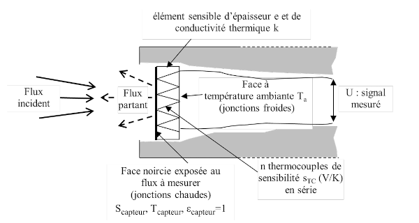

# Préambule

## Introduction

L'objectif de cette séance de travaux pratiques est d’explorer les mécanismes de
transfert thermique par rayonnement et d’étudier les paramètres influençant le
flux radiatif émis par une surface. Les variations du flux seront examinées en
fonction de la nature du matériau, de son état de surface, de sa température,
ainsi que de l'effet d’un écran en verre.

## Notions clés

Tout corps à une température $T>0K$ émet un rayonnement thermique, dû à la
conversion de son énergie interne en énergie électromagnétique. Ce rayonnement,
caractérisé par des longueurs d'onde de 1 à 100 ${\mu m}$ inclut les domaines
ultraviolet, visible et infrarouge. Contrairement à la conduction et à la
convection, le transfert radiatif ne nécessite pas de support matériel et se
propage en ligne droite.

Loi de Planck (puissance spectrale):
:   TODO : revoir l'unité de cette formule

   $$M_\lambda^0(T) = \frac{C_1 \lambda^{-5} }{ e^{C_2 / (\lambda T)} - 1 }$$

Où $C_{1} = 3,741.10^{8}W.m^{-2}.\mu m^{4}$ et $C_{2} = 14388 \mu m.K$

<!--
---
-->

Loi de Stefan-Boltzmann (flux total):
:  
   $$M^0(T) = \sigma T^4 \quad \text{avec} \quad \sigma = 5{,}67 \cdot 10^{-8}
   \, \text{W} \cdot \text{m}^{-2} \cdot \text{K}^{-4}$$

Cette loi correspond à l'intégrale de la fonciton de Planck sur tout le spectre mais également au flux émis par $1m^{2}$ de corps noir dans toutes les directions pour toutes les longueurs d'onde.
<!--
---
-->

Loi de Wien (longueur d'onde maximale):
:  

   $$\lambda_m T = 2898 \, \mu \text{m} \cdot \text{K}$$

<!--
--- 
-->

## Approche expérimentale 

Ce TP s'appuie sur les dispositifs suivants :

<!--
- __Cube multi-faces chauffé__ : avec des surfaces ayant des états différents (noire mate, blanche mate, aluminium poli et non poli) pour étudier l’influence de l’émissivité.
-->

Cube multi-faces chauffé: 
:   avec des surfaces ayant des états différents (noire mate, blanche mate,
aluminium poli et non poli) pour étudier l’influence de l’émissivité (voir
Figure \ref{fig:cube})

{#fig:cube width=50%}

Lampe à filament de tungstène: 
:   permettant d’atteindre des températures élevées, avec T déduit de la résistance R via :

$$T = -0,053 \cdot \left(\frac{\rho_a R}{R_a}\right)^2 + 36.1 \cdot \left(\frac{\rho_a R}{R_a}\right) + 125$$

Thermopile: 
:   pour mesurer le flux radiatif net ${\Phi_{net}}$​ à partir de la tension générée:

$$U = s \cdot \Phi_\text{net} \quad \text{avec} \quad \Phi_\text{net} = \Phi_\text{émis} - \Phi_\text{absorbé}$$

Voir Figure \ref{fig:thermopile}

{#fig:thermopile}

---

### Objectif 

En combinant théorie et expérimentation, cette séance vise à :

Vérifier les lois fondamentales du rayonnement thermique.
Étudier l’influence des propriétés de surface et de la température sur le flux émis.
Analyser l’effet d’un écran en verre sur les échanges radiatifs.

Les résultats obtenus seront comparés aux modèles théoriques pour mieux comprendre les limitations expérimentales.

## Travail préparatoire

Réalisé sur AMeTICE

Notions principales abordées : 

- En rayonnement, un rayon monochromatique signifie un rayon d'une seule longueur d'onde
- Un flux absorbé par une surface à tendance à réchauffer la surface
- Un flux émis par une surface à tendance à refroidir la surface
- Un flux transmis ou réfléchi par une surface ne modifie pas la température
- Le flux partant ${\phi^{partant}}$ d'une surface opaque S d'émissivité $\epsilon$ à température T faisant face à une surface environnante assimilée au corps noir à température $T_{a}$ s'exprime par :
 $${\phi^{partant}} = \epsilon \cdot \sigma \cdot T^{4} + (1+\epsilon) \cdot \sigma \cdot {T_{a}}^{4}$$

- Un flux émis par un expérimentateur peut se réfléchir sur le cube vers la thermopile

# Expériences 

## Approche qualitative

L’objectif est ici de se familiariser avec la notion d’émetteur et de récepteur de rayonnement ainsi
que de dégager qualitativement des tendances de comportement de différentes surfaces.

### Sensibilisation au pouvoir émissif

En plaçant la main devant chaque face du cube, avec notre ressenti, nous avons
pu établir un classement du « pouvoir émissif ». TDODO (faire le classement de chaque
face du cube)

| Face supérieure | Face latérale 1 | Face latérale 2 | Face latérale 3 | Face latérale 4 |
|------------------|-----------------|-----------------|-----------------|-----------------|
| Ressenti 1       | Ressenti 2      | Ressenti 3      | Ressenti 4      | Ressenti 5      |

:Sensibilisation au pouvoir émissif - Ressenti à l'approche de chaque face du cube.

### Thermopile

La thermopile délivre des tensions différentes lorsqu'on la place devant des surfaces de températures différentes TODO (étudier le signe de cette tension, évoquer la comparaison avec les sensations au dessus)

### Analyse

## Approche quantitative

### Influence de la nature de la surface et de sa température

Détail de chaque composante de l'équation (15):

$$U(V) = s [\phi^{incident}_{capteur} - \phi^{partant}_{capteur}] = -s \phi^{net}_{capteur} = s [\phi^{absorbé}_{capteur} - \phi^{émis}_{capteur}] = U(V)$$

- $U(V)$ ici représente la tension mesurée par la thermopile. Cette tension est directement proportionnelle à la différence entre le flux incident $\phi^{incident}_{capteur}$​ et le flux partant $\phi^{partant}_{capteur}$ sur la face avant du capteur.
L'équation montre que U(V) est également lié au flux net ($\phi^{net}_{capteur}$​).

- $\phi^{incident}_{capteur}$ correspond au flux incident, c'est-à-dire le rayonnement thermique qui arrive sur la face avant du capteur.
Ce flux dépend de la température $T_{objet}$​ de l'objet observé, ainsi que de son émissivité ($\epsilon_{objet}$​) et du facteur de forme ($F_{capteur \rightarrow objet}$​) entre le capteur et l'objet (ici supposé à 1).

- $\phi^{partant}_{capteur}$ représente le flux partant, c'est-à-dire le rayonnement thermique émis par la face avant du capteur en direction de l'objet.
Le flux partant est constant si la température de la face avant du capteur ($T_{capteur}$​) reste proche de la température ambiante ($T_{a}$​), ce qui est le cas grâce à la faible résistance thermique de l'élément sensible (fine feuille de métal noircie).

- $\phi^{net}_{capteur}$ Le flux net est défini comme la différence entre le flux incident ($\phi^{incident}_{capteur}$​) et le flux partant ($\phi^{partant}_{capteur}$​).
Il représente le bilan global de rayonnement thermique sur le capteur, qui est à l'origine de la tension mesurée U(V).

- $\phi^{absorbé}_{capteur}$ correspond au flux thermique effectivement absorbé par la face avant du capteur.
Ce flux dépend des propriétés optiques du capteur, notamment de son émissivité ($\epsilon_{capteur}$​), et de l'énergie apportée par le rayonnement incident.

- $\phi^{émis}_{capteur}$ représente le flux thermique émis par la face avant du capteur en raison de sa propre température $T_{capteur}$.
Ce flux reste constant si $T_{capteur}$​ s'élève peu et reste proche de $T_{a}$​ (température ambiante).

- $s$ est la sensibilité du capteur, exprimée en mV/mW. Elle quantifie la relation entre la variation de flux thermique (en milliwatts) et la tension mesurée (en millivolts).

TODO : répondre aux questions

### Transmission du rayonnement

Transmissivité dans le visible :
Le verre est transparent dans le visible $\lambda \approx 0.4 \, \text{à} \, 0.7 \mu m$, donc la transmissivité $\tau$ est proche de 1 dans cette plage.

Transmissivité dans l’infrarouge :
Le verre est opaque aux longueurs d’onde infrarouges $\lambda \geq 0.7 \mu m$, donc $\tau$ chute brutalement vers 0. Cela explique l’effet de serre, car les rayonnements infrarouges émis par les objets chauffés ne traversent pas le verre.

TODO compléter le graphique et répondre aux autres questions

Graphique complété :

Dans le visible : $\tau \approx 1$ (ligne horizontale haute).    Dans l’infrarouge : $\tau \approx 0$ (ligne horizontale basse après le visible).

__Application : __

Dans une voiture avec pare-brise, le tableau de bord chauffe davantage à cause de l’effet de serre :

- Flux solaire ($\Phi_{solaire}$​) : Le rayonnement visible traverse le pare-brise et est absorbé par le tableau de bord noir.
- Émission infrarouge ($\Phi_{IR}$​) : Le tableau de bord réémet de l’énergie en infrarouge, mais le pare-brise bloque ce rayonnement, le piégeant dans l’habitacle.
- Isolation thermique : Le pare-brise limite les pertes par convection et conduction, augmentant encore la température.

__$\rightarrow$__ Sans pare-brise, les flux infrarouges s’échapperaient et le tableau de bord serait moins chaud.

### Influence de la température de la source