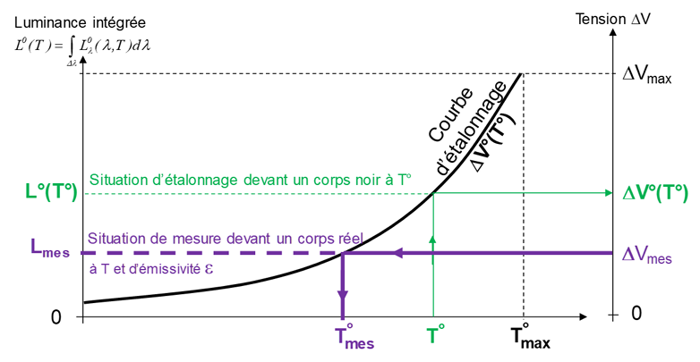

# Préambule

## Introduction

L’imagerie infrarouge est un outil essentiel permettant d'observer la chaleur émise par des objets, bien au-delà de ce que l’œil humain peut percevoir. Grâce à une caméra infrarouge, il est ainsi possible de repérer et étudier les changements de température d’une scène, avec des applications variées allant de l’industrie à la recherche scientifique, en passant par la thermographie des bâtiments.

Ce TP a pour but de nous familiariser avec le fonctionnement de la caméra infrarouge et de comprendre comment elle capte et traduit le rayonnement thermique en images exploitables. À travers différentes expériences, nous observerons l’influence de l’émissivité et de la température sur les images obtenues. En utilisant des sources radiatives comme un corps noir ou des surfaces aux propriétés thermiques variées, nous verrons comment interpréter correctement ces images et ce qu’elles nous apprennent sur les objets observés.

## Matériel utilisé

### Station d'imagerie et de mesure infrarouge

La chaîne de visualisation et d’acquisition d’images infrarouges comprend tout d’abord la caméra
infrarouge (modèle A40 fabriquée par FLIR) à matrice dans le plan focal de l’objectif (FPA :
Focal Plane Array) dont la surface sensible est constituée d’une matrice de 320 x 240 détecteurs
microbolométriques (voir la photo en Figure \ref{fig:camera}).

{#fig:camera}

Cette chaîne est schématisée sur la Figure \ref{fig:scene}. L’objectif (ou optique sur le schéma) est constitué
de lentilles en Germanium (transparent dans l’infrarouge, traité antireflet). La matrice de microbo
lomètres, placée après l’objectif, reçoit le flux radiatif venant d’une surface de la scène thermique
correspondant à la surface conjuguée de la matrice à travers l’objectif de la caméra (voir Figure \ref{fig:scene}).

{#fig:scene}

Chaque détecteur de la matrice est sensible dans la gamme 7,5-13 $\mu m$. Il faut noter que à température ambiante (environ 20-25°C), la majorité des rayonnements thermiques des objets est émise dans cette plage de 7 à 13 $\mu m$. Cela permet à la caméra de capter le maximum d'énergie thermique des objets sans être trop influencée par d'autres sources de rayonnement, comme la lumière visible ou l'infrarouge proche.

Ces détecteurs sont des microbolomètres, de la famille des détecteurs thermiques, dont le principe est
basé sur l’échauffement du détecteur consécutif à l’absorption du flux infrarouge pendant une durée
donnée, appelée « temps d’intégration ». Cet échauffement du détecteur induit une variation de sa ré
sistance électrique dont la mesure est alors proportionnelle au flux infrarouge absorbé. Les tensions
délivrées, alors, par tous les détecteurs de la matrice sont lues puis numérisées et transmis à l'ordinateur.

### Sources radiatives

#### Corps noir
\

La source radiative de référence (ou « référence thermorayonnante ») utilisée est un corps noir de
laboratoire (Figure \ref{fig:corps_noir}).

Il s’agit d’une cavité cylindrique à fond conique, revêtue d’un
matériau très absorbant, à facteur de forme élevé (profondeur > diamètre), chauffée de façon isotherme
par des résistances électriques. Il est équipé d’un disque percé de diaphragmes de tailles différentes
qui peuvent se placer devant l’entrée de la cavité. La gamme de température qu’il peut couvrir va
de l’ambiante à 1000 degrés, elle est mesurée par une sonde platine en fond de cavité. L’image que l’on a
en observant un tel corps noir placé par exemple à 100 degrés dans un environnement à 20 degrés est donc
un disque (« fort » flux quittant la cavité) se détachant de son environnement.

{#fig:corps_noir}

#### Cube de Leslie
\

Ce cube (Voir Figure \ref{fig:cube}) présente 4 facettes latérales en aluminium chauffées par une ampoule de 100W placée au centre. La temérature de chaque face peut être supposée uniforme. Les quatre faces présentent un état de surface différent : peinture noire, peinture blanche, aluminium non poli, aluminium poli.

Lors du TP précédent, nous avons pu faire un classement des émissivités de chaque face:

| Face | Émissivité ($\epsilon_{0.4 - 40 \mu m}$) |
|:----------------:|:-----------:|
| Noire                | 0.94|
| Blanche              | 0.92|
| Polie                | 0.05|
| Non polie            | 0.1 |

:Émissivités de chaque face calculées lors du TP précédent.

Nous avions également pu réaliser un classement des faces en fonction de leur pouvoir réfléchissant, par ordre croissant : Face noire, face blanche, face non polie puis face polie.

La réflexion de rayonnement par la face en aluminium poli est de type spéculaire (rayons concentrés dans 1 seule direction), alors que pour les autres faces, elle pourra être considérée diffuse (rayonnement réparti sur une plus grande surface).

Un pouvoir réfléchissant élevé signifie que le flux de chaleur ne passe pas à travers la surface, il est donc réfléchi par celle-ci, ainsi la chaleur est renvoyée sur la thermopile.

{#fig:cube}

#### Plaque chauffante à différentes émissivités

Il s’agit d’une plaque en cuivre régulée en température dont la surface est peinte en noir. Locale
ment, comme vous pouvez l’observer sur la Figure \ref{fig:plaque}, l’émissivité de la surface a été modifiée par
l’ajout d’adhésifs en aluminium (de gauche à droite : adhésif seul, adhésif + scotch blanc, adhésif +
vernis). 

La visualisation de cette plaque par la caméra infrarouge permettra donc de s’intéresser aux
conséquences de l’émissivité d’une surface sur son image infrarouge, pour une température identique
(que l’on suppose non modifiée par l’ajout de l’adhésif).

{#fig:plaque}

## Travail préparatoire

Réalisé sur Amétice.

Notions importantes abordées :

- Le signal électrique de la caméra infrarouge est proportionnel au flux total reçu par le détecteur. Ce flux comprend :
    - Le rayonnement émis par la scène thermique (proportionnel à sa température et son émissivité).
    - Le rayonnement réfléchi provenant de l’environnement.

- L'expérience d'étalonnage d'une caméra infrarouge consiste à viser un corps noir à température connue et enregistrer la tension délivrée par le détecteur infrarouge de la caméra.
    
    Par exemple, si une caméra infrarouge vise une surface « réelle » (c'est à dire « non-noire ») de température réelle inconnue et placée dans un environnement de température inconnue et indique que sa température apparente corps noir de 57°C, cela signifie que 
    cette surface envoie un flux infrarouge vers la caméra qui correspond à celui qu'émettrait le corps noir à 57°C

- La caméra infrarouge mesure une température apparente corps noir, mais la température vraie de la surface dépend de son émissivité et du rayonnement réfléchi par l’environnement.

# Expériences

## Observation d'un corps noir et de surfaces non noires en environnement uniforme

### Introduction

L’étalonnage de la caméra infrarouge consiste à enregistrer la réponse (en V) de la caméra face à un corps noir de laboratoire à température variable $T^{0}$​. La tension mesurée $\Delta V_{0}(T_{0})$ est liée à la température $T^{0}$ par la formule suivante :

$$\Delta V^0(T^0) = k \int_{\lambda} R(\lambda) L^{0}(\lambda, T^{0}) \, d\lambda \tag{1}$$

Avec : 

- $R(\lambda)$ la sensibilité spectrale relative du détecteur dans la bande $\Delta \lambda$.
- k une constante dépendant de la sensibilité maximale (en V/W) du détecteur, du gain de la chaîne
d’amplification et des grandeurs relatives à la géométrie de la détection.

Lors de la mesure sur un corps réel, l'émissivité $\epsilon (\lambda)$ influence la tension mesurée $\Delta V_{mes}$​, qui peut être exprimée par :

$$\Delta V_{mes} = k \int_{\lambda} R(\lambda) \varepsilon(\lambda) L^0_{\lambda} (\lambda, T) \, d\lambda + k \int_{\lambda} R(\lambda) \left[ 1 - \varepsilon(\lambda) \right] L^0_{\lambda} (\lambda, T_a)  d\lambda \tag{2}$$

Soit  :

$$\Delta V_{mes} = \epsilon_{\Delta \lambda} \Delta V^0(T) + (1 - \epsilon_{\Delta \lambda}) \Delta V^0(T_{a}) = \Delta V^0(T^0) \tag{3}$$

Avec : 

$$ \epsilon_{\Delta \lambda} = \frac{\int_{\lambda} \epsilon(\lambda)R(\lambda)L^0_{\lambda}(\lambda,T) d\lambda}{\int_{\lambda} R(\lambda)L^0_{\lambda}(\lambda,T) d\lambda} \tag{4}$$

La température apparente du corps réel, $T^{0}_{mes}$​, est calculée en fonction de $\Delta V_{mes}$​, offrant ainsi une estimation de la température du matériau observé.

$$(T^{0}_{mes})^{4} = \epsilon_{\Delta \lambda} T^4 + (1-\epsilon_{\Delta \lambda})T^4_{a} \tag{5}$$

Avec : 

- $T^{0}_{mes}$ la température apparente corps noir
- $\epsilon_{\Delta \lambda}$ l’émissivité spectrale de la surface dans la bande spectrale de la caméra.
- T la vraie température
- $T_{a}$ la température de l'environnement

Donc, plus l'émissivité de la surface est grande (proche de 1), plus la température mesurée sera proche de la température vraie.
Inversement, si l'émissivité est faible (proche de 0), la température mesurée sera proche de la température ambiante.

### Travail à réaliser

Pour commencer, un étalonnage de la caméra est nécéssaire, pour cela il faut utiliser un corps noir à température connue (affichage sur un régulateur).

Cet étalonnage est réalisé en placant le corps noir devant la caméra (Voir Figure \ref{fig:exp1}) et en vérifiant que la température mesurée par la caméra correspond bien à la température mesurée sur le régulateur.

{#fig:exp1}

Cette expérience permet d'obtenir la température du corps noir grâce à $T_{mes}$ ainsi que la vraie température donnée par les thermocouples. La température ambiante $T_{a}$ et l'équation (5) sont également nécéssaires.

L'émissivité du corps noir est donc $\epsilon = \frac{T^{4}_{mes} - T^{4}_{a}}{T^{4} - T^{4}_{a}} = \frac{A-B}{C-D} \approx$

Cette émissivité est proche de 1 (émissivité d'un corps noir), l'erreur relative est de $\frac{\epsilon_{mes}-1}{1} \approx %$

Dans notre cas (TODO : faire la mesure et observer paragraphe d'avant)

TODO : Expérience de la figure 7 à droite du TP (dans notre compte rendu mettre la figure et la numérotée) 

Maintenant que la caméra est étalonnée, il est possible de faire la mesure sur des corps réels comme indiqué sur la Figure \ref{fig:exp2}.
Une plaque chauffante (Voir Figure \ref{fig:plaque}) sur laquelle sont placés différents matériaux, faisant donc varier les émissivités des parties de la plaque.

{#fig:exp2}

Pour obtenir les températures apparentes corps noires des différentes surfaces il faut utiliser la courbe d'étalonnage :

{#fig:courbe}

Pour chaque surface la tension $\Delta V$ est mesurée par la caméra infrarouge, on peut donc retouver $T_{mes}$ en retrouvant l'abscisse de la courbe correspondant à $\Delta V$. TODO : Remettre peut-être la formule correspondante.

Pour calculer les émissivités des différentes surfaces on peut utiliser (la formule correspondante TODO : remmetre la formule) ou ( on peut comparer la Tmes précédente avec la température réelle mesurée avec les thermocouples).

|Surface observée|Température T du thermocouple associé (°C)|Température $T_{mes} relevée par la caméra (°C)| Emissivité $\epsilon$|
|:-----:|:-----:|:-----:|:-----:|
|Noire|     |     |     |
|Aluminium|     |     |     |
|Aluminium + vernis|     |     |     |
|Aluminium + scotch|     |     |     |

: Tableau des mesures et des émissivités calculées

Pour résumer : 

Les surfaces qui sont peintes en noir ou qui ont des propriétés similaires à celles d'un corps noir auront une émissivité proche de 1. Cela signifie qu'elles émettent presque toute l'énergie qu'elles reçoivent.

Les surfaces métalliques ou brillantes, en revanche, auront une émissivité plus faible, ce qui signifie qu'elles reflètent une grande partie de l'énergie incidente et émettent moins d'énergie, on remarque ici que le vernis est +/- émissif que l'adhésif.

## Influence d’un environnement non uniforme sur l’observation d’objets non noirs : réflexions parasites

TODO : Mettre la figure 9 du TP ( légendé (reprendre la légende du TP) et numérotés dans notre compte-rendu)

TODO : Mettre la figure 10 du TP ("" "" "" "" ) 

