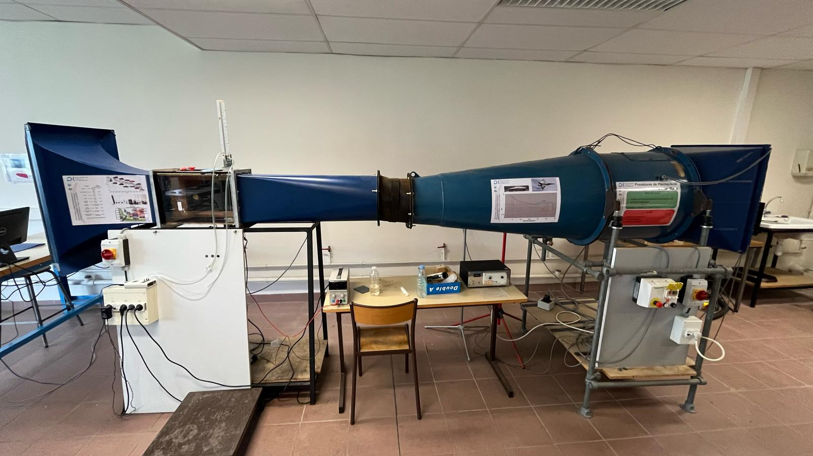
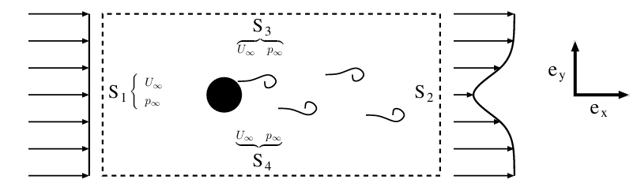
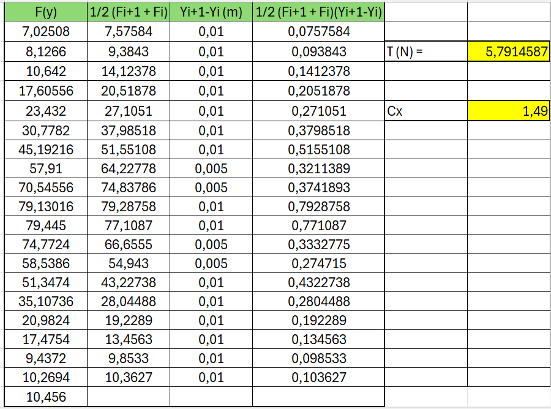
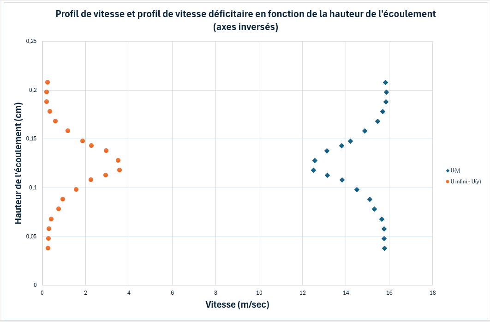
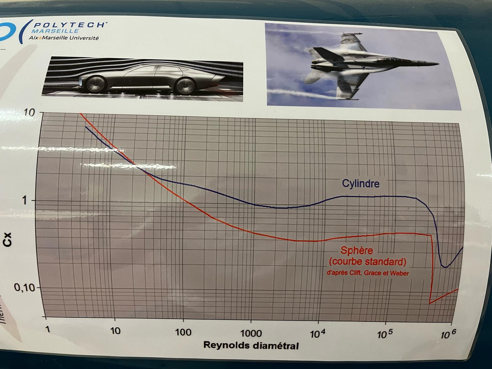

# Préambule

## Introduction

Ce travail pratique a pour objectif d'étudier l'écoulement autour et en aval d'un cylindre, en utilisant le tube de Pitot pour mesurer la vitesse du fluide. Il s'agit également d'exploiter les notions de mécanique des fluides abordées au semestre S5 afin de déterminer la force de traînée exercée sur le cylindre. L'analyse repose sur le nombre de Reynolds, qui gouverne les différentes structures d'écoulement, allant d'un régime symétrique à l'apparition d’une allée tourbillonnaire de Bénard–von Kármán. La traînée est ensuite déterminée par une approche indirecte, basée sur la mesure du champ de vitesse en aval et l'application des principes de conservation de la quantité de mouvement.

## Ecoulement autour d'un cylindre

Dans cette partie nous allons étudier l'écoulement de l'air autour et en aval d’un cylindre. A l'aide d'un tube de Pitot la vitesse de l’air est mesurée, on pourra également calculer la force de traînée qui agit sur le cylindre. L’écoulement autour du cylindre est influencé par le nombre de Reynolds $({Re})$, qui dépend de la vitesse de l'air $(U_{\infty})$, du diamètre du cylindre $(D)$ et de la viscosité du fluide $(\mu)$. Ce nombre est un indicateur clé pour savoir si l’écoulement est laminaire ou turbulent.

$$Re_{D} = \frac{\rho D U_{\infty}}{\mu} \tag{1}$$

{#fig:ecoulement}

\newpage

Lorsque Re est faible (lorsque l'inertie du fluide est faible par rapport aux effets visqueux), l'écoulement est symétrique de part et d'autre du cylindre. Mais à mesure que Re augmente, l'écoulement devient de plus en plus instable, et on observe la formation de tourbillons dans le sillage du cylindre. À partir de $Re_{D} \geq 50$, ces tourbillons commencent à se détacher du cylindre à une fréquence régulière, créant une structure tourbillonnaire très spécifique, connue sous le nom d’« allée de Bénard–von Kármán » (Voir Figure \ref{fig:regime_laminaire}).

\begin{figure}
    \centering
    \begin{minipage}{0.45\textwidth}
        \centering
        \includegraphics[width=\linewidth]{regime_laminaire.png}
        \caption{Régime laminaire $Re_{D} \approx 2.10^2$}
        \label{fig:regime_laminaire}
    \end{minipage}
    \hfill
    \begin{minipage}{0.45\textwidth}
        \centering
        \includegraphics[width=\linewidth]{regime_turbulent.png}
        \caption{Régime turbulent $Re_{D} \approx 2.10^2$}
        \label{fig:regime_turbulent}
    \end{minipage}
\end{figure}

## Force et coefficient de traînée

Ces tourbillons créent des forces variables sur le cylindre, appelées forces de traînée, qui oscillent au rythme de l’émission des tourbillons. Bien que ces forces fluctuent dans le temps, l’ingénieur se concentre souvent sur la moyenne de ces forces, particulièrement pour la traînée, qui est la composante de la force agissant dans la direction de l’écoulement.

Formule du coefficient de trainée : 
$$C_{x} = \frac{T}{\frac{1}{2} \rho U^{2}_{\infty} D L} = f(Re_{D}) \tag{2}$$

L'évolution du coefficient de traînée $C_{x}$ en fonction du nombre de Reynolds $Re_{D}$ est tracée en figure \ref{fig:Cx}.

{#fig:Cx}

## Mesure de la traînée

L’un des moyens les plus directs pour mesurer ces forces est d'utiliser une balance aéro-dynamique, mais ici, nous recourons à une méthode indirecte : en mesurant le champ de vitesse autour du cylindre avec un tube de Pitot, puis en appliquant le théorème de conservation de la quantité de mouvement pour estimer la force de traînée. 

On obtient ainsi l'équation reliant la trainée moyenne par unité de longueur de cylindre T aux valeurs des vitesses et pression moyenne aux frontières du domaine de contrôle :

$$T = -\int\int_{U^{4}_{i=1}S_{i}}\rho U_{x}(\vec{U}.\vec{n})dS - \int\int_{U^{4}_{i=1}S_{i}} \rho \vec{n}.\vec{e_{x}}dS \tag{3}$$

## Dispositif expérimental

La soufflerie utilisée dans ce TP est une soufflerie Eiffel à veine fermée et circuit ouvert, avec une section d’essai de 0,2 × 0,3 $m^{2}$. L’air est mis en mouvement par un ventilateur en aval, et la vitesse de l’écoulement (1 à 15 m/s) est contrôlée par un régulateur. 

\ref{fig:dispositif} :

{#fig:dispositif}

Des cylindres de différents diamètres peuvent être fixés au centre de la veine d’essai. Un dispositif de visualisation par filets de fumée permet d'observer les trajectoires des particules fluides. 

Une sonde Pitot, reliée à un manomètre différentiel, permet de mesurer :

- la différence entre la pression d'arrêt (extrémité du cube) et la pression statique (corps du
 tube), utile pour mesurer la vitesse dans l'écoulement.
- la différence entre la pression atmosphérique et la pression statique, utile pour mesurer la pression statique dans l'écoulement.

Ce dispositif nous permettra ainsi de mesurer la traînée et d'analyser les résultats en fonction des paramètres d'écoulement.

# Expériences

## Travail prépartoire

1) La relation liant la vitesse à la différence entre pressions d'arrêt et statique mesurées par le tube de Pitot est la suivante :

$$P_{atm}-P=\frac{\rho}{2}U^{2}$$
$$ \Leftrightarrow U = \sqrt{\frac{2\cdot(P_{atm}-P)}{\rho}} $$

2) Pour une vitesse d'écoulement $U_{\infty} = 1m/sec$, le nombre de Reynolds se calcule avec la relation suivante :

$$ Re = \frac{\rho U_{\infty} D}{\mu}$$

Avec $\rho$ la masse volumique du fluide, $\mu$ la viscosité dynamique du fluide, D le diamètre du cylindre.

|Diamètre D| 2,5cm | 1mm|
|:---:|:---:|:---:|
|Reynolds| 1743 | 70 |

Valeurs utilisées : $\rho_{air} = 1,29kg/m^{3} \, et \, \mu_{air} = 18,5\cdot10^{-6}Pa.s$

On remarque donc que le cylindre avec le plus petit diamètre a un Reynolds plus faible donc ses effets visqueux plus marqués.

Le cylindre avec le plus grand diamètre aura un Reynolds plus élevé, ce qui signifie que les forces d'inertie prédomineront sur les forces visqueuses.

3) Formulation du théorème de conservation de la masse pour le volume de contrôle défini à la figure \ref{fig:volume_controle} :

{#fig:volume_controle}

L'équation de conservation de la masse stationnaire si $\rho = cste$ est :

$$ \int\int_{U^{4}_{i=1}S_{i}}\rho \vec{U}.\vec{n}dS = 0 $$

Une fois multiplié par la constante $U_{\infty}$, l'équation obtenue est : 

$$ U_{\infty}\int\int_{U^{4}_{i=1}S_{i}}\rho \vec{U}.\vec{n}dS = 0 $$

4) Théorème de Bernoulli entre l'extérieur de la soufflerie et la surface S1 :

$$ P_{\infty} + \frac{\rho}{2} U_{\infty}^{2} + \rho g z_{\infty} = P_{atm} + \frac{\rho}{2}U_{1}^{2} + \rho g z_{1}$$

Les termes de pression hydrostatique $\rho g z$ sont négligés dans cette situation car l'altitude est la même le long de la soufflerie.

Donc on en déduit : $P_{\infty} = P_{atm} + \frac{1}{2}\rho (U_{1}^{2}-U_{\infty}^{2})$

5) Nos résultats obtenus dans les questions (3) et (4) sont : 

Conservation du débit massique :

$$ U_{\infty}\int\int_{U^{4}_{i=1}S_{i}}\rho \vec{U}.\vec{n}dS = 0 $$

Relation de pression issue de Bernoulli :
$$P_{\infty} = P_{atm} + \frac{1}{2}\rho (U_{1}^{2}-U_{\infty}^{2})$$

Ces équations doivent être injectées dans l'équation (8) de l'énoncé :

$$
T = \rho \left( \int_{S_1} U_{\infty}^2 \, dy - \int_{S_2} U_x(y)^2 \, dy  
- \int_{S_3} U_{\infty} U_y(x) \, dx + \int_{S_4} U_{\infty} U_y(x) \, dx \right)
+ \int_{S_1} p_{\infty} \, dy - \int_{S_2} p(y) \, dy.
$$

Le but étant d'obenir l'équation (9) de l'énoncé : 

$$
T \simeq \sum_{i=1}^{N-1} \frac{\mathcal{F}_{i+1} + \mathcal{F}_i}{2} (y_{i+1} - y_i)  
- \frac{1}{2} \rho U_{\infty}^2 (y_N - y_1).
$$

Lors de calculs effectués en séance de TP avec le professeur, le résultat final est :

$$T = \int \int(\rho U(y)[U_{\infty} -U(y)]-\frac{\rho}{2}U_{\infty}^{2}+\Delta P(y))dS$$

## Travail en séance

### Visualisation

Les tourbillons ont été observés dans l'écoulement après avoir placé un cylindre et de la fumée.

On observe pour le cylindre de diamètre 2,5 cm que les troubillons sont d'environ de la taille du cylindre et espacés d'environ une dizaine de centimètres entre eux.

Concernant le cylindre de diamètre 1mm, les tourbillons sont plus difficiles à observer, en effet ils n'ont pas vraiment une forme "ronde". On remarque que la distance entre les tourbillons est plus courte, il semble y avoir une fréquence d'émission plus importante que pour le premier cylindre.

En comparaison avec les images de la \ref{fig:ecoulement}, nous voyons une similitude entre la photo (d) et l'écoulement pour le cylindre de diamètre 2,5cm avec un Reynolds de 1743 soit proche des 2000 de la figure.

La fréquence d'émission est calculée pour chaque cylindre grâce à la formule suivante :

$$f_{émission} = 0,198(1-\frac{19,7}{Re_{D}})\frac{U_{\infty}}{D}$$

Pour le premier cylindre, le diamètre vaut 2,5cm, $Re_{D}$ vaut 1743 et $U_{\infty}$ vaut 1m/sec (vitesse de l'écoulement de la soufflerie).

Ainsi $f_{émission} = 7,83 \text{ } sec^{-1}$
La période d'émission est donc $\frac{1}{f_{émission}} \approx 0,128 \text{ } sec$.

En multipliant par la vitesse du tourbillon $U_{convection} \approx 0,85U_{\infty}$ on obtient une distance de 0,108 m soit environ 10cm.

Ce résultat est cohérent avec nos observations, nous observions un tourbillon toutes les dizaines de centimètres.

Pour le second cylindre de diamètre 1mm, $Re_{D}$ vaut 70 et $U_{\infty}$ vaut toujours 1m/sec.

Ainsi $f_{émission} \approx 142,277 \text{ } sec^{-1}$
La période d'émission est donc $\frac{1}{f_{émission}} \approx 7\cdot 10^{-3} \text{ } sec$.

En multipliant par la vitesse du tourbillon $U_{convection} \approx 0,85U_{\infty}$ on obtient $5,97 \cdot 10^{-3} m$ soit une distance d'environ 6mm entre chaque tourbillon.

Ce résultat est cohérent car nous avons nous avons observé une distance entre les tourbillons de l'ordre du centimètre. Les diamètres des tourbillons de diamètre étaient supérieurs à celui de la tige (1mm).

### Calcul de la trainée

Pour commencer, nous avons mesuré la vitesse à différentes hauteurs de la vanne, une vitesse de 16,08 m/sec en moyenne est retenue grâce au tube de Pitot. Donc $U_{\infty} = 16,08 m/sec.$

Les valeurs des différences de pression ont été mesurées également à différentes hauteurs de la vanne, permettant d'obtenir un terme $\Delta P$, utile pour calculer la traînée par la suite.

La force de traînée T est calculée grâce au travail préparatoire : 

$$T = \int \int(\rho U(y)[U_{\infty} -U(y)]-\frac{\rho}{2}U_{\infty}^{2}+\Delta P(y))dS$$

On définit la fonction F(y) telle que $F(y)= \rho U(y)[U_{\infty} -U(y)]-\frac{\rho}{2}U_{\infty}^{2}+\Delta P(y)$

On a donc $T = \int \int F(y)dS$

F(y) se calcule avec la méthode des trapèzes.
Notons $y_{i}$ et $F_{i}$ les termes à la mesure i.
L'intégrale se calcule comme la somme suivante :

$$
T \simeq \sum_{i=1}^{N-1} \frac{\mathcal{F}_{i+1} + \mathcal{F}_i}{2} (y_{i+1} - y_i)$$

Le coefficeint de traînée $Cx$ se calcule avec la formule suivante : 

$$Cx = \frac{T}{\frac{\rho}{2}U_{\infty}^{2}D}$$

Les calculs ont été faits sur excel (voir Figure \ref{fig:calculs_excel})

Au final, nous trouvons une force de traînée de 5,79 Newtons et Cx = 1,49.

{#fig:calculs_excel}

Les profils des vitesses et vitesses déficitaires en fonction de la hauteur de la vanne sont tracées en Figure \ref{fig:vitesses}

{#fig:vitesses}

\newpage

**Détermination de la force de traînée**

Si la vitesse d'entrée $U_{\infty}$ était différente (10 m/sec par exemple), on aurait pu retrouver la valeur de la force de trainée T à partir du  coefficient de traînée Cx.

En effet, le coefficient Cx reste constant dans une plage large de Reynolds. (Voir Figure \ref{fig:coeff})

On peut donc alors retrouver T grâce à 
$$Cx = \frac{T}{\frac{\rho}{2}U_{\infty}^{2}D} \rightarrow T = Cx \frac{\rho}{2}U_{\infty}^{2}D$$

Donc par exemple, en gardant le même Cx que nous avons trouvé, $$T = 1,49\cdot \frac{1,2}{2}\cdot10^2 \cdot 2,5\cdot 10^{-2} = 2,235 N$$

{#fig:coeff}

# Conclusion

Ce TP nous a permis d’étudier l’écoulement autour d’un cylindre et la traînée associée en exploitant les principes de la mécanique des fluides. L’analyse des régimes d’écoulement et de l’allée de Bénard-von Kármán a été menée via des mesures par sonde Pitot, confirmant les tendances théoriques du coefficient de traînée en fonction du nombre de Reynolds.  

Les résultats, globalement cohérents avec la théorie, ont mis en évidence l’influence des effets visqueux et inertiels, malgré certaines incertitudes de mesure. Cette expérience renforce notre compréhension des phénomènes d’écoulement et des méthodes expérimentales essentielles en aérodynamique et hydrodynamique.