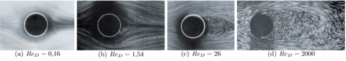
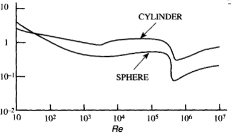

# Préambule

## Introduction

Ce travail pratique a pour objectif d'étudier l'écoulement autour et en aval d'un cylindre, en utilisant le tube de Pitot pour mesurer la vitesse du fluide. Il s'agit également d'exploiter les notions de mécanique des fluides abordées au semestre S5 afin de déterminer la force de traînée exercée sur le cylindre. L'analyse repose sur le nombre de Reynolds, qui gouverne les différentes structures d'écoulement, allant d'un régime symétrique à l'apparition d’une allée tourbillonnaire de Bénard–von Kármán. La traînée est ensuite déterminée par une approche indirecte, basée sur la mesure du champ de vitesse en aval et l'application des principes de conservation de la quantité de mouvement.

## Ecoulement autour d'un cylindre

Dans cette partie nous allons étudier l'écoulement de l'air autour et en aval d’un cylindre. A l'aide d'un tube de Pitot la vitesse de l’air est mesurée, on pourra également calculer la force de traînée qui agit sur le cylindre. L’écoulement autour du cylindre est influencé par le nombre de Reynolds $({Re})$, qui dépend de la vitesse de l'air $(U_{\infty})$, du diamètre du cylindre $(D)$ et de la viscosité du fluide $(\mu)$. Ce nombre est un indicateur clé pour savoir si l’écoulement est laminaire ou turbulent.

$$Re_{D} = \frac{\rho D U_{\infty}}{\mu} \tag{1}$$

{#fig:ecoulement}

\newpage

Lorsque Re est faible (lorsque l'inertie du fluide est faible par rapport aux effets visqueux), l'écoulement est symétrique de part et d'autre du cylindre. Mais à mesure que Re augmente, l'écoulement devient de plus en plus instable, et on observe la formation de tourbillons dans le sillage du cylindre. À partir de $Re_{D} \geq 50$, ces tourbillons commencent à se détacher du cylindre à une fréquence régulière, créant une structure tourbillonnaire très spécifique, connue sous le nom d’« allée de Bénard–von Kármán » (Voir Figure \ref{fig:regime_laminaire}).

\begin{figure}
    \centering
    \begin{minipage}{0.45\textwidth}
        \centering
        \includegraphics[width=\linewidth]{regime_laminaire.png}
        \caption{Régime laminaire $Re_{D} \approx 2.10^2$}
        \label{fig:regime_laminaire}
    \end{minipage}
    \hfill
    \begin{minipage}{0.45\textwidth}
        \centering
        \includegraphics[width=\linewidth]{regime_turbulent.png}
        \caption{Régime turbulent $Re_{D} \approx 2.10^2$}
        \label{fig:regime_turbulent}
    \end{minipage}
\end{figure}

## Force et coefficient de traînée

Ces tourbillons créent des forces variables sur le cylindre, appelées forces de traînée, qui oscillent au rythme de l’émission des tourbillons. Bien que ces forces fluctuent dans le temps, l’ingénieur se concentre souvent sur la moyenne de ces forces, particulièrement pour la traînée, qui est la composante de la force agissant dans la direction de l’écoulement.

Formule du coefficient de trainée : 
$$C_{x} = \frac{T}{\frac{1}{2} \rho U^{2}_{\infty} D L} = f(Re_{D}) \tag{2}$$

L'évolution du coefficient de traînée $C_{x}$ en fonction du nombre de Reynolds $Re_{D}$ est tracée en figure \ref{fig:Cx}.

\newpage

{#fig:Cx}

## Mesure de la traînée

L’un des moyens les plus directs pour mesurer ces forces est d'utiliser une balance aéro-dynamique, mais ici, nous recourons à une méthode indirecte : en mesurant le champ de vitesse autour du cylindre avec un tube de Pitot, puis en appliquant le théorème de conservation de la quantité de mouvement pour estimer la force de traînée. 

On obtient ainsi l'équation reliant la trainée moyenne par unité de longueur de cylindre T aux valeurs des vitesses et pression moyenne aux frontières du domaine de contrôle :

$$T = -\int\int_{U^{4}_{i=1}S_{i}}\rho U_{x}(\vec{U}.\vec{n})dS - \int\int_{U^{4}_{i=1}S_{i}} \rho \vec{n}.\vec{e_{x}}dS \tag{3}$$

TODO : en dessous tu voulais dire quoi ?
((Une autre partie de ce TP consiste à déterminer le coefficient de traînée (Cx), qui permet de quantifier l'efficacité de la forme du cylindre à générer de la traînée. Ce coefficient dépend fortement du nombre de Reynolds.))

## Dispositif expérimental

La soufflerie utilisée dans ce TP est une soufflerie Eiffel à veine fermée et circuit ouvert, avec une section d’essai de 0,2 × 0,3 $m^{2}$. L’air est mis en mouvement par un ventilateur en aval, et la vitesse de l’écoulement (1 à 15 m/s) est contrôlée par un régulateur. 

TODO : photo de la soufflerie à faire en TP

Des cylindres de différents diamètres peuvent être fixés au centre de la veine d’essai. Un dispositif de visualisation par filets de fumée permet d'observer les trajectoires des particules fluides. 

Une sonde Pitot, reliée à un manomètre différentiel, permet de mesurer :

- la différence entre la pression d'arrêt (extrémité du cube) et la pression statique (corps du
 tube), utile pour mesurer la vitesse dans l'écoulement.
- la différence entre la pression atmosphérique et la pression statique, utile pour mesurer la pression statique dans l'écoulement.

Ce dispositif nous permettra ainsi de mesurer la traînée et d'analyser les résultats en fonction des paramètres d'écoulement.

# Expériences

## Travail prépartoire

1) La relation liant la vitesse à la différence entre pressions d'arrêt et statique mesurées par le tube de Pitot est la suivante :

$$P_{atm}-P=\frac{\rho}{2}U^{2}$$
$$ \Leftrightarrow U = \sqrt{\frac{2\cdot(P_{atm}-P)}{\rho}} $$

2) Pour une vitesse d'écoulement $U_{\infty} = 1m/sec$, le nombre de Reynolds se calcule avec la relation suivante :

$$ Re = \frac{\rho U_{\infty} D}{\mu}$$

Avec $\rho$ la masse volumique du fluide, $\mu$ la viscosité dynamique du fluide, D le diamètre du cylindre.

|Diamètre D| 2,5cm | 1mm|
|:---:|:---:|:---:|
|Reynolds| 1743 | 70 |

Valeurs utilisées : $\rho_{air} = 1,29kg/m^{3} \, et \, \mu_{air} = 18,5\cdot10^{-6}Pa.s$

On remarque donc que le cylindre avec le plus petit diamètre a un Reynolds plus faible donc ses effets visqueux plus marqués.

Le cylindre avec le plus grand diamètre aura un Reynolds plus élevé, ce qui signifie que les forces d'inertie prédomineront sur les forces visqueuses.

3) L'équation de conservation de la masse stationnaire si $\rho = cste$ est :

$$ \int\int_{U^{4}_{i=1}S_{i}}\rho \vec{U}.\vec{n}dS = 0 $$

TODO : Mettre la même formule mais on multiplie par U infinie et on le met hors de l'intégrale

4) Théorème de Bernoulli entre l'extérieur de la soufflerie et la surface S1 :

$$ \P_{\infty}+\fract{
TODO : Mettre  la formule p infinie + un demi de rho U infinie au carré = P atm + un demi de rho  U1 au carré
Donc dire que P infine = Patm + un demi de rho (facteur de U1 au carré - U infine au carré)

TODO : finir question 4 et 5

## Travail en séance

### Visualisation

### Calcul de la trainée

# Conclusion
