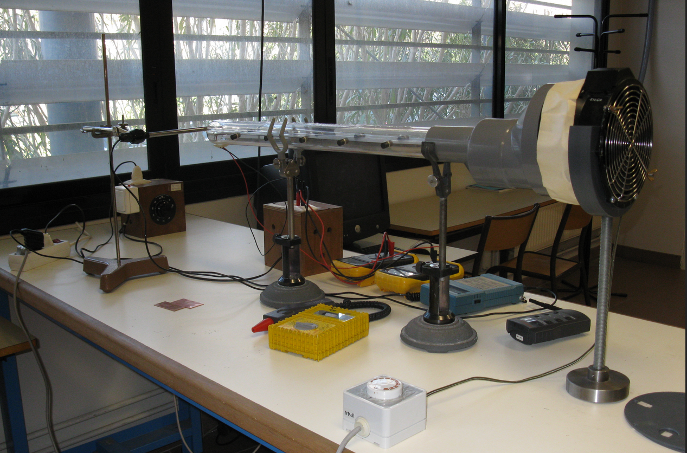

# Introduction

## Contexte et objectif

L'échange de chaleur entre un solide et un fluide environnant se fait principalement par convection. Ce transfert dépend de l'écoulement du fluide autour du solide et est caractérisé par un **coefficient d'échange convectif** $h$. 

L'objectif de ce TP est d'étudier la variation de $h$ en fonction de la vitesse d'écoulement autour d'une plaque rectangulaire horizontale, ainsi que l'effet des **ailettes** pour améliorer ces échanges thermiques. Ce principe est largement utilisé dans des systèmes comme les **radiateurs de microprocesseurs** ou les **convecteurs domestiques**.

## Concepts théoriques clés

- **Convection forcée** : Transfert thermique par un fluide en mouvement imposé (ventilation). Le flux thermique convectif est donné par :  
  $$
  \Phi_{cv} = h \cdot S \cdot \Delta T
  $$
  où $S$ est la surface d'échange et $\Delta T$ la différence de température entre le fluide et le solide.

- **Couche limite thermique** : Région proche de la paroi où la température évolue progressivement vers celle du fluide ambiant.

- **Nombre de Nusselt $Nu$** : Rapport entre transfert thermique par convection et par conduction, défini par :  
  $$
  Nu = \frac{h L}{k}
  $$
  où $L$ est une longueur caractéristique et $k$ la conductivité thermique du fluide.

- **Nombre de Reynolds $Re$** : Paramètre déterminant le régime d'écoulement (laminaire ou turbulent) :  
  $$
  Re = \frac{\rho U L}{\mu}
  $$
  où $\rho$ est la masse volumique du fluide, $U$ la vitesse d'écoulement, $L$ une longueur caractéristique et $\mu$ la viscosité dynamique du fluide.

- **Nombre de Prandtl $Pr$** : Rapport entre la diffusion thermique et la diffusion visqueuse, défini par :  
  $$
  Pr = \frac{\mu C_p}{k}
  $$
  où $C_p$ est la capacité calorifique du fluide.

Dans le cas d'une plaque plane en régime laminaire ($Re_L < 3 \cdot 10^5$), la relation entre ces nombres est :  
$$
Nu_L = 0.665 \cdot Re_L^{0.5} \cdot Pr^{1/3}
$$
Pour un écoulement turbulent ($Re_{T} > 5 \cdot 10^5 Pr > 0.5$) :  
$$
Nu_T = 0.035 \cdot Re_T^{4/5} \cdot Pr^{1/3}
$$

## Dispositif expérimental

L'étude est réalisée à l'aide d'un banc d'essai (voir Figure \ref{fig:dispositif}) permettant de générer un écoulement d'air autour de surfaces chauffées et d'en mesurer les effets thermiques. Le montage expérimental comprend :

- **Un film chauffant** (résistance électrique) pris en sandwich entre **deux plaques de cuivre** de $3.8$ cm de large, $6.4$ cm de long et $2$ mm d'épaisseur.
- **Un tube en Plexiglas** dans lequel circule l'air à différentes vitesses générées par un **ventilateur**.
- **Une sonde à fil chaud** permettant de mesurer la vitesse de l'écoulement.
- **Une alimentation en courant continu** avec affichage de la tension et du courant appliqués à la résistance chauffante.
- **Un thermocouple de type K** placé sur la plaque pour mesurer la température de surface.

Une deuxième configuration intègre une **ailette en cuivre** de **50 cm de long, 3 cm de large et 1 mm d'épaisseur**, permettant d'analyser son impact sur l'amélioration des échanges thermiques.

{#fig:dispositif}

## Effet des ailettes

L'ajout d'ailettes est une technique courante pour augmenter les échanges de chaleur entre un solide et un fluide. En augmentant la surface d'échange, elles permettent une meilleure dissipation thermique. Le principe repose sur deux phénomènes :

1. **Augmentation de la surface d'échange** : Plus la surface est grande, plus le flux thermique total $\Phi$ est important.
2. **Conduction et convection combinées** : La chaleur est transférée par conduction le long de l'ailette, puis dissipée par convection.

La température d'une ailette suit une décroissance exponentielle donnée par :  
$$
T(x) = T_{\infty} + (T_0 - T_{\infty}) e^{-\frac{x}{L}}
$$
où :

- $T(x)$ est la température à une distance $x$ de la base de l'ailette.
- $T_{\infty}$ est la température du fluide ambiant.
- $T_0$ est la température de la base de l'ailette.
- $L$ est la **longueur caractéristique de l'ailette** :  
  $$
  L = \sqrt{\frac{k S}{h P}}
  $$
  avec $k$ la conductivité thermique du matériau, $S$ la section de l'ailette et $P$ son périmètre.

Le flux total évacué par l'ailette est donné par :  
$$
\Phi = h P L (T_0 - T_{\infty})
$$
Cette expression permet d'évaluer l'efficacité des ailettes en fonction du **coefficient d'échange convectif** $h$, de la **conductivité thermique** $k$ et de la **géométrie de l'ailette**.

## Expérience

L'étude repose sur deux dispositifs :

1. Une **plaque chauffante en cuivre** soumise à un écoulement d'air pour déterminer $h$.
2. Une **ailette en cuivre** permettant d'analyser la propagation de la chaleur et d'évaluer son efficacité.

Les mesures incluent la température de surface (via **thermocouples**), la vitesse d'écoulement (**sonde à fil chaud**) et la puissance dissipée (**tension et courant appliqués**).

Les résultats permettront d'établir la relation entre **Nu et Re**, et d'évaluer l'impact des ailettes sur l'amélioration des échanges thermiques.

