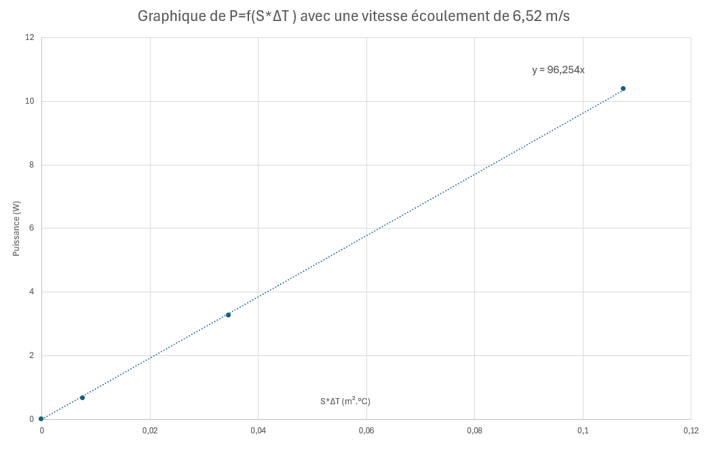
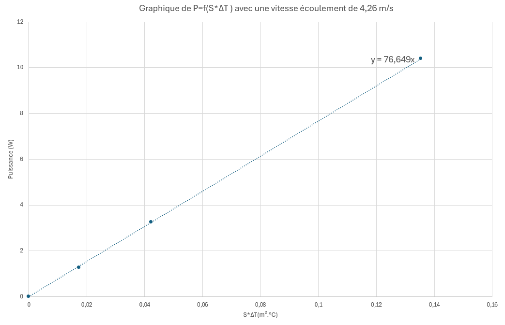
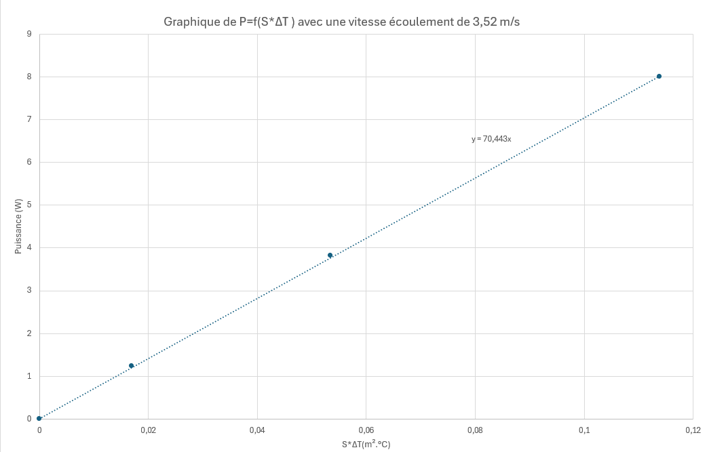
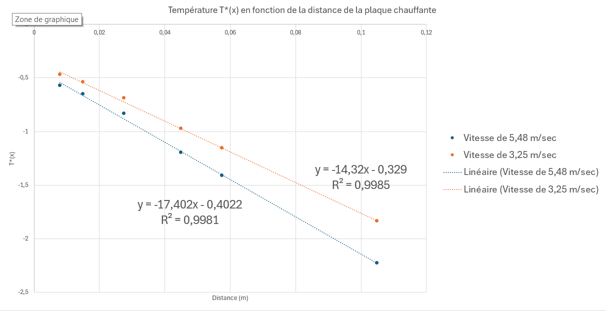

# Introduction

## Contexte et objectif

L'échange de chaleur entre un solide et un fluide environnant se fait principalement par convection. Ce transfert dépend de l'écoulement du fluide autour du solide et est caractérisé par un coefficient d'échange convectif $h$. 

L'objectif de ce TP est d'étudier la variation de $h$ en fonction de la vitesse d'écoulement autour d'une plaque rectangulaire horizontale, ainsi que l'effet des ailettes pour améliorer ces échanges thermiques. Ce principe est largement utilisé dans des systèmes comme les radiateurs de microprocesseurs ou les convecteurs domestiques.

## Concepts théoriques clés

- **Convection forcée** : Transfert thermique par un fluide en mouvement imposé (ventilation). Le flux thermique convectif est donné par :  
  $$
  \Phi_{cv} = h \cdot S \cdot \Delta T
  $$
  où $S$ est la surface d'échange et $\Delta T$ la différence de température entre le fluide et le solide.

- **Couche limite thermique** : Région proche de la paroi où la température évolue progressivement vers celle du fluide ambiant.

- **Nombre de Nusselt $Nu$** : Rapport entre transfert thermique par convection et par conduction, défini par :  
  $$
  Nu = \frac{h L}{k}
  $$
  où $L$ est une longueur caractéristique et $k$ la conductivité thermique du fluide.

- **Nombre de Reynolds $Re$** : Paramètre déterminant le régime d'écoulement (laminaire ou turbulent) :  
  $$
  Re = \frac{\rho U L}{\mu}
  $$
  où $\rho$ est la masse volumique du fluide, $U$ la vitesse d'écoulement, $L$ une longueur caractéristique et $\mu$ la viscosité dynamique du fluide.

- **Nombre de Prandtl $Pr$** : Rapport entre la diffusion thermique et la diffusion visqueuse, défini par :  
  $$
  Pr = \frac{\mu C_p}{k}
  $$
  où $C_p$ est la capacité calorifique du fluide.

Dans le cas d'une plaque plane en régime laminaire ($Re_L < 3 \cdot 10^5$), la relation entre ces nombres est :  
$$
Nu_L = 0.665 \cdot Re_L^{0.5} \cdot Pr^{1/3}
$$
Pour un écoulement turbulent ($Re_{T} > 5 \cdot 10^5 Pr > 0.5$) :  
$$
Nu_T = 0.035 \cdot Re_T^{4/5} \cdot Pr^{1/3}
$$

## Dispositif expérimental

L'étude est réalisée à l'aide d'un banc d'essai (voir Figure \ref{fig:dispositif}) permettant de générer un écoulement d'air autour de surfaces chauffées et d'en mesurer les effets thermiques. Le montage expérimental comprend :

- Un film chauffant (résistance électrique) pris en sandwich entre deux plaques de cuivre de $3.8$ cm de large, $6.4$ cm de long et $2$ mm d'épaisseur.
- Un tube en Plexiglas dans lequel circule l'air à différentes vitesses générées par un ventilateur.
- Une sonde à fil chaud permettant de mesurer la vitesse de l'écoulement.
- Une alimentation en courant continu avec affichage de la tension et du courant appliqués à la résistance chauffante.
- Un thermocouple de type K placé sur la plaque pour mesurer la température de surface.

Une deuxième configuration intègre une ailette en cuivre de 50 cm de long, 3 cm de large et 1 mm d'épaisseur, permettant d'analyser son impact sur l'amélioration des échanges thermiques.

{#fig:dispositif}

\newpage

## Effet des ailettes

L'ajout d'ailettes est une technique courante pour augmenter les échanges de chaleur entre un solide et un fluide. En augmentant la surface d'échange, elles permettent une meilleure dissipation thermique. Le principe repose sur deux phénomènes :

1. **Augmentation de la surface d'échange** : Plus la surface est grande, plus le flux thermique total $\Phi$ est important.
2. **Conduction et convection combinées** : La chaleur est transférée par conduction le long de l'ailette, puis dissipée par convection.

La température d'une ailette suit une décroissance exponentielle donnée par :  
$$
T(x) = T_{\infty} + (T_0 - T_{\infty}) e^{-\frac{x}{L}}
$$
où :

- $T(x)$ est la température à une distance $x$ de la base de l'ailette.
- $T_{\infty}$ est la température du fluide ambiant.
- $T_0$ est la température de la base de l'ailette.
- $L$ est la longueur caractéristique de l'ailette :  
  $$
  L = \sqrt{\frac{k S}{h P}}
  $$
  avec $k$ la conductivité thermique du matériau, $S$ la section de l'ailette et $P$ son périmètre.

Le flux total évacué par l'ailette est donné par :  
$$
\Phi = h P L (T_0 - T_{\infty})
$$
Cette expression permet d'évaluer l'efficacité des ailettes en fonction du coefficient d'échange convectif $h$, de la conductivité thermique $k$ et de la géométrie de l'ailette.

# Expériences

## Détermination des coefficients d'échange convectifs h

### Procédure à suivre

 Afin de déterminer le coefficier d'échange convectif $h$, on fixe une vitesse d'écoulement $v$ sur le ventilateur. Un thermocouple nous permet d'obtenir la température $T_0$ à la sortie (une fois la température stabilisée).

Une tension est ensuite imposée sur la résistance dans la plaque chauffante, créant ainsi une puissance $P$. Cette puissance sera utilisée ainsi que la surface de la plaque chauffante $S$ pour déterminer le coefficient d'échange convectif $h$ grâce à la formule : 

$$
  P = UI = \Phi_{cv} = h \cdot S \cdot \Delta T
$$

Les différences de température sont prises lorsque une tension est appliquée à la résistance, permettant d'obtenir le terme $\Delta T$.

On obtient $h$ avec nos mesures $P = f(S.\Delta T)$, ainsi $h$ est le coefficient directeur de la droite.

$$\rightarrow h = \frac{\Phi_{cv}}{S \cdot \Delta T}$$

Ainsi, voici nos coefficients d'échanges convectifs pour chaque vitesse :

|Vitesse (m/sec) | Coefficient d'échange convectif $h$ (W/m².°C)|
|:----:|:----:|
|6,52|96,25|
|4,26|76,65|
|3,52 |70,44 |

Voici nos graphiques de $P=f(S.\Delta T)$ pour différentes vitesses :

{width=80%}

{width=80%}

{width=80%}

\newpage

### Dépendance du coefficient d'échange

Pour déterminer la dépendance du coefficient d'échange, $h$ à la vitesse $v$, on trace $h = f(v)$.

.png){#fig:h_v width=80%}

### Nu en fonction du Reynolds

Pour tracer $Nu = f(Re)$ on a $Re = \frac{\rho U L}{\mu}$ et $Nu = \frac{h L}{k}$

On utilise la longueur de la plaque $L = 6,8\cdot 10^{-2}m$ et en se référant aux tables à notre disposition on a pour l'air $\rho_{air} =1,16 \text{ } kg.m^{-3} , \mu_{air} = 184,6\cdot 10^{-7} \text{ } N.s.m^{-2}, k_{air} = 26,3\cdot 10^{-3} W.m^{-1}K^{-1}$$

|Vitesse (m/sec) | Re | Nu |
|:----:|:----:|:---:|
|6,52| 27860  | 248,86  |
|4,26| 18203| 198,18  |
|3,52 |15041 | 182,13  |

Nous avons des nombres de Reynolds inférieurs à $3\cdot 10^{5}$  donc le régime est Laminaire.

La théorie montre que dans ce type d'écoulements, $Nu = 0,665\cdot Re_{L}^{0,5} \cdot Pr^{\frac{1}{3}}$

Donc $Nu$ évolue en fonction de la racine du Reynolds, nos graphiques (Figure \ref{fig:h_v} et \ref{fig:Nu_Re}) de $h = f(v)$ et $Nu = f(Re)$ démontrent bien cette évolution car avec un profil de puissance nous obtenons une puissance proche de 0,5 dans les deux cas.

.png){#fig:Nu_Re width=80%}

## Profils d'ailette

Travaillons maintenant avec le dispositif grandes dimensions, constitué d'une ailette de 50cm de long à l'extrémité de deux plaques de cuivres rectangulaires prenant en sandwich un film chauffant.

### Mesures du profil stationnaire de température dans l'ailette

Pour cela, nous chauffons à l'origine de la plaque et imposons une vitesse de 5,48 m/sec à l'écoulement, puis de m/sec.

Nous obtenons un profil des températures le long de la plaque pour chaque vitesse.

On remarque la forme d'une exponentielle décroissante dans les deux cas car : $T(x) = T_{\infty} + (T_0 - T_{\infty}) e^{-\frac{x}{L}}$

D'où : $ln(\frac{T-T_{\infty}}{T_0-t_{\infty}}) \propto -\frac{x}{L}$

Ainsi, le tracé de la température le long de la plaque chauffante est tracé pour chaque vitesse (voir Figure \ref{fig:profil_temperatures})

{#fig:profil_temperatures}

### Détermination de la longueur caractéristique

Nous trouvons ainsi les coefficients $\frac{1}{L}$, pentes des courbes, nous donnant $L$, longueur caractéristique, pour chaque vitesse de l'écoulement. On obtient donc L = 6,98 cm pour une vitesse de 3,25 m/sec et L = 5,75 pour une vitesse de 5,48 m/sec.

On remarque donc que plus la vitesse est élevée, moins la longueur caractéristique est grande car il y a un plus grand flux d'air qui permet de diminuer la température de la surface (atteindre $T_{\infty}$ plus rapidement).

# Conclusion

Les expériences menées ont permis d’analyser l’influence de la vitesse d’écoulement sur le coefficient d’échange convectif hh et d’observer que hh suit une loi en racine de Reynolds, conformément aux modèles théoriques. L’ajout d’ailettes s’est révélé efficace pour améliorer le transfert thermique, en augmentant la surface d’échange et en favorisant la dissipation de chaleur. La diminution de la longueur caractéristique avec l’augmentation de la vitesse confirme que le flux thermique est mieux réparti à grande vitesse. Enfin, les résultats expérimentaux sont cohérents avec les prédictions théoriques, validant ainsi les modèles utilisés.
