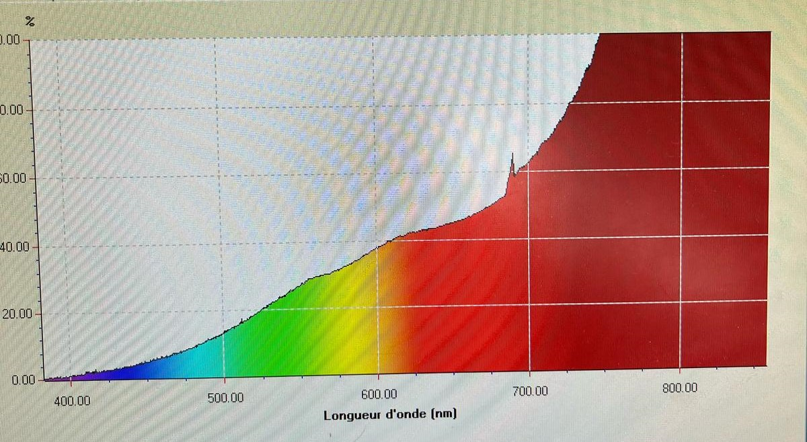
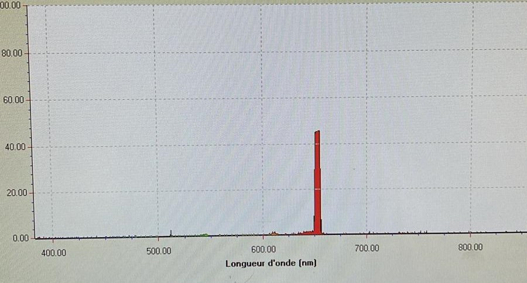

# Introduction

La spectrophotométrie et la pyrométrie sont deux techniques essentielles en physique permettant d’analyser les interactions entre la lumière et la matière. La spectrophotométrie repose sur l’absorption et la transmission de la lumière par un échantillon afin d’en déduire des informations telles que la concentration d’une substance ou ses propriétés optiques. La pyrométrie, quant à elle, est une méthode permettant de mesurer la température d’un objet en analysant le rayonnement qu’il émet.

## Le spectre électromagnétique

Le rayonnement électromagnétique regroupe les ondes classées selon leur longueur d’onde $\lambda$ ou leur fréquence $\nu$. Il se divise en plusieurs domaines :

Le spectre visible (380-780 nm) : perçu par l’œil humain, il correspond aux couleurs visibles des objets éclairés.
  
Les rayonnements énergétiques (longueurs d’onde courtes, hautes fréquences) :
    
- Ultraviolets (UVA, UVB, UVC) : responsables des coups de soleil.
    
- Rayons X : utilisés en imagerie médicale.
    
- Rayons gamma : issus des réactions nucléaires et cosmiques.
    
Les rayonnements moins énergétiques (longueurs d’onde longues, basses fréquences) :
    
- Infrarouges : liés au rayonnement thermique.
    
- Micro-ondes : utilisées en télécommunications et cuisson.
    
- Ondes radio et hertziennes : utilisées pour la transmission d’informations.

Un spectre représente l’intensité lumineuse en fonction de la longueur d’onde. Ce TP étudiera le rayonnement thermique et celui issu de la désexcitation des atomes et molécules d’un gaz.

{#fig:spectres}

## Le rayonnement thermique

Le rayonnement thermique d’une surface est comparé à celui d’un corps noir, un émetteur parfait absorbant toute la lumière incidente. Son rayonnement dépend de la température T et de la longueur d’onde $\lambda$.

**Loi de Planck**

Elle décrit l’énergie rayonnée par un corps noir à température T :

$L_{0}(\lambda, T) = \frac{C_1}{\lambda^5} \cdot \frac{1}{\exp\left(\frac{C_2}{\lambda T}\right) - 1}$

avec $C_1$​ et $C_2$​ des constantes. Elle montre que plus un corps est chaud, plus il émet d’énergie et que son spectre présente un maximum d’intensité.

**Loi de Wien**

Elle donne la longueur d’onde où l’émission est maximale :

$\lambda_{max}(\mu m)= \frac{2898}{T}$

**Émissivité et température de luminance :**

Un corps réel n’émet jamais autant qu’un corps noir et possède une émissivité $\epsilon$ inférieure à 1 :

$L(\lambda ,T)= \epsilon (\lambda ,T) \cdot L_0(\lambda,T)$

On définit aussi une température de luminance $T_L$​, toujours inférieure à la température réelle du corps. Si $\epsilon$ est constant, le corps est dit "gris".

{#fig:planck}

\newpage

## Le pyromètre optique

Un pyromètre optique mesure la température d’une source via un détecteur photoélectrique.

- Monochromatique : mesure la luminance à une seule longueur d’onde, dépendant de l’émissivité $\epsilon$.
  
- Bi-chromatique : compare la luminance à deux longueurs d’onde, évitant l’influence de $\epsilon$.
  
- À large bande : mesure l’énergie totale émise.

Les pyromètres à disparition de filament comparent la luminance d’une source à celle d’un filament de tungstène, ajusté jusqu’à disparition visuelle.

## Travaux préliminaires

1) Loi de Planck : $L_{0}(\lambda, T) = \frac{C_1}{\lambda^5} \cdot \frac{1}{\exp\left(\frac{C_2}{\lambda T}\right) - 1}$

Avec $C_1 = 2hc^2$, $C_2 = \frac{hc}{k}$.

Pour trouver le maximum de la luminance on résout : $\frac{dL_0}{d \lambda} = 0$

$\rightarrow \frac{dL_0}{d \lambda} = C_1[-5 \lambda^{-6}\frac{1}{\exp{\frac{C_2}{\lambda T}}-1} + \lambda^{-5} \cdot \frac{\frac{C_2}{\lambda^{2} T}\exp{\frac{C_2}{\lambda T}}}{(\exp{\frac{C_2}{\lambda T}}-1)^{2}}] = 0$

$\rightarrow \frac{5}{\lambda^{6}\cdot \exp{\frac{C_2}{\lambda T}}-1} = \frac{C_2 \cdot \exp{\frac{C_2}{\lambda T}}}{\lambda^{7} T \cdot \exp{\frac{C_2}{\lambda T}}-1}^{2}$

$\rightarrow \lambda = \frac{C_2 \exp\left(\frac{C_2}{\lambda T}\right)}{5T \left( \exp\left(\frac{C_2}{\lambda T}\right) - 1 \right)}$

Posons $x = \frac{C_2}{\lambda T}$, alors :

$\rightarrow \lambda = \frac{C_2 e^x}{5 (e^x - 1) T}$

En multipliant par $x$:

$5 (e^x - 1) = x e^x$

Ainsi, la longueur d'onde maximale $\lambda_{\text{max}}$ vérifie :

$x_{\text{max}} = \frac{C_2}{\lambda_{\text{max}} T} \approx 4.9651$

$\lambda_{\text{max}} = \frac{C_2}{4.9651 T}$

Avec $C_2 = 1.4388 \times 10^{-2}$, on obtient :

$\lambda_{\text{max}} = \frac{1.4388 \times 10^{-2}}{4.9651 T} = \frac{2898}{T} \quad \text{(en µm)}$

2) Déplacement du spectre d'émission

Lorsque la température d'un objet augmente, son spectre d'émission se décale vers de plus petites longueurs d'onde car :

$\lambda_{\text{max}} \propto \frac{1}{T}$

3) Apparition des couleurs visibles

Lorsque la température d'un objet augmente petit à petit, la première couleur visible est le rouge, car il émet d'abord dans l'infrarouge. Ensuite, la longueur d'onde diminue pour tendre vers le bleu.

4) Relation entre luminance et émissivité

$L(\lambda, T) = \varepsilon(\lambda, T) \cdot L_0(\lambda, T)$

$\Rightarrow L(\lambda, T) = L_0(\lambda, T_L) \cdot \exp\left(-\frac{C_2}{\lambda T}\right)$

$\Rightarrow \exp\left(-\frac{C_2}{\lambda T_L}\right) = \varepsilon(\lambda, T) \cdot \exp\left(-\frac{C_2}{\lambda T}\right)$

En appliquant $\ln$ :

$-\frac{C_2}{\lambda T_L} = -\frac{C_2}{\lambda T} + \ln(\varepsilon(\lambda, T))$

$\Rightarrow \frac{1}{T_L} = \frac{1}{T} - \frac{\lambda}{C_2} \ln(\varepsilon)$

Avec : $C_2\approx 1,4388\cdot 10^{-2} m.K, \text{ } T = 1500 K \text{ } et  \text{ } \lambda = 0,85 \mu m$

$A.N. \text{ Pour } \epsilon = 0,9  :\text{  } \frac{1}{T_L} = 6,73 \times 10^{-4} \ \text{K}^{-1}$ $\Rightarrow T_L = 1488 \ \text{K}$

$A.N. \text{ Pour } \epsilon = 0,1 : \text{  } \frac{1}{T_L} =  8,03 \times 10^{-4} \ \text{K}^{-1}$ $\Rightarrow T_L = 1245 \ \text{K}$

On en conclut que plus l’émissivité est faible, plus la température de luminance $T_L$ est inférieure à la température réelle $T$.
Un pyromètre monochromatique est très sensible à l’émissivité.

5) Nouvelle expression de la luminance

$L(\lambda, T) = \varepsilon(\lambda, T) \exp\left(-\frac{C_2}{\lambda T}\right)$

$v_{\lambda_1} = K(\lambda_1) \varepsilon(\lambda_1) \exp\left(-\frac{C_2}{\lambda_1 T}\right)$

Avec :

$K(\lambda_{1}) = R \cdot S_{\lambda_{1}} \cdot T_{\rho_{\lambda_{1}}} \cdot d\lambda_{1} \cdot T_{0\lambda} \cdot \Omega \cdot S \cdot \tau_{1\lambda}$

# Expériences 

## Spectrophotométrie

Le dispositif expérimental de spectrophotométrie comprend un spectrophotomètre piloté par le logiciel SPID-HR, plusieurs sources de rayonnement et des filtres. Le spectrophotomètre mesure le spectre de la source analysée. Une fibre optique guide la lumière vers un miroir parabolique, qui réfléchit un faisceau parallèle vers un réseau. Ce réseau, gravé régulièrement, produit des figures de diffraction par interférence, séparant les longueurs d’onde. Un second miroir focalise ensuite ces faisceaux sur un détecteur CCD de 2048 pixels, chaque pixel capturant une plage de 0,23 nm. Le logiciel SPID-HR permet l’acquisition et l’affichage en temps réel des spectres entre 376 nm et 846 nm.

### Expériences à réaliser

Nous observons différentes sources de lumière avec différents filtres de couleurs :

### Analyse spectrale de différentes sources lumineuses

Les spectres de différentes sources lumineuses sont disponibles en annexe à la fin du compte rendu.

#### Lampe à décharge
- Le spectre est discret, composé de raies d’émission caractéristiques des éléments présents dans le gaz.  
- Ce spectre est dû à des transitions électroniques dans les atomes excités, ce n'est pas un rayonnement thermique.

#### Lampe à filament de tungstène  
- Spectre continu, s’étendant du visible à l’infrarouge.  
- Il s’agit d’un rayonnement thermique conforme au modèle du corps noir.  
- Lorsque la température augmente, l’intensité du spectre croît et le maximum d’émission se déplace vers les courtes longueurs d’onde.  

#### Diode électroluminescente   
- Spectre étroit, centré sur une longueur d’onde spécifique.  
- Il correspond à l’énergie du gap électronique du matériau semi-conducteur utilisé.  
- Ce n’est pas un rayonnement thermique, mais une émission de fluorescence.  

#### Flamme de bougie  

Le spectre est mixte :

- Un fond continu dû au rayonnement thermique.  
- Des raies d’émission spécifiques aux éléments chimiques présents dans la combustion (cire de la bougie).  

### Identification des raies spectrales de la lampe à décharge  

Nous observons le spectre de la lampe à décharge (Voir figure \ref{fig:sodium}). Il est possible de remarquer différentes raies à différentes longueurs d'ondes. On compare avec le spectre théorique (Figure \ref{fig:sodium_th}) et on remarque que il y a une raie à environ 590 nm, présente sur le spectre obtenu. 

Il y a également plusieurs raies au delà de 700 nm. Ces différentes raies sont dues à la réflexion de la petite raie du spectre théorique (entourée sur la figure) qui se réfléchit sur les parois du tube autour de la lampe. Ce rayonnement vient donc chauffer le tube et explique ainsi les différentes raies observées au delà de 700 nm.

\begin{figure}
    \centering
    \begin{minipage}{0.45\textwidth}
        \centering
        \includegraphics[width=\linewidth]{sodium.jpeg}
        \caption{Spectre de la lampe à décharge (lampe à sodium)}
        \label{fig:sodium}
    \end{minipage}
    \hfill
    \begin{minipage}{0.45\textwidth}
        \centering
        \includegraphics[width=\linewidth]{sodium_th.png}
        \caption{Spectre théorique de la lampe à sodium}
        \label{fig:sodium_th}
    \end{minipage}
\end{figure}

### Observation du spectre de la lampe à filament de tungstène à différentes températures  

Lorsque la température du filament augmente, le spectre s’intensifie et le maximum d’émission se déplace vers les longueurs d’onde plus courtes, ce qui est en accord avec la loi de Wien et la loi de Planck sur le rayonnement thermique. Cela confirme que la lampe à filament émet un spectre de corps noir, typique des sources thermiques.

### Effet des filtres de couleur  

| Filtre | Effet sur la lumière transmise |
|:--------:|:-------------------------------:|
| Bleu | Laisse passer le bleu et le violet, bloque le rouge et le jaune. |
| Vert | Laisse passer le vert, absorbe le bleu et le rouge. |
| Jaune | Laisse passer le jaune et le rouge, bloque le bleu. |
| Rouge | Laisse passer le rouge et une partie de l’orange, bloque le vert et le bleu. |

\begin{figure}
    \centering
    \begin{minipage}{0.45\textwidth}
        \centering
        \includegraphics[width=\linewidth]{bleu.jpeg}
        \caption{Vue avec un filtre bleu}
    \end{minipage}
    \hfill
    \begin{minipage}{0.45\textwidth}
        \centering
        \includegraphics[width=\linewidth]{vert.jpeg}
        \caption{Vue avec un filtre vert}
    \end{minipage}
\end{figure}

\begin{figure}
    \centering
    \begin{minipage}{0.45\textwidth}
        \centering
        \includegraphics[width=\linewidth]{rouge.jpeg}
        \caption{Vue avec un filtre rouge}
    \end{minipage}
    \hfill
    \begin{minipage}{0.45\textwidth}
        \centering
        \includegraphics[width=\linewidth]{jaune.jpeg}
        \caption{Vue avec un filtre jaune}
    \end{minipage}
\end{figure}

L’utilisation de ces filtres permet d’analyser la composition spectrale des sources lumineuses en éliminant certaines longueurs d’onde et en mettant en évidence les parties dominantes du spectre.

## Pyrométrie

L’objectif de cette expérience est de mesurer et d’analyser la température du filament en fonction du courant qui le traverse.

Pour ce faire, nous exploitons la variation de la résistance électrique du filament, qui dépend directement de sa température. En comparant la résistance mesurée à sa valeur à température ambiante, il est possible d’en déduire la température du filament à l’aide d’une relation empirique. Cette approche permet une estimation précise sans contact direct avec la source de chaleur.

L’expérimentation repose sur plusieurs instruments : une lampe à filament de tungstène alimentée en courant continu, des dispositifs de mesure (voltmètre et ampèremètre) pour déterminer la résistance du filament, ainsi qu’un système optique et des photodiodes permettant d’analyser la lumière émise à différentes longueurs d’onde. Un amplificateur logarithmique est également utilisé pour étudier le rapport des courants mesurés par les photodiodes.

Ce protocole permet d’établir une corrélation entre l’intensité lumineuse émise et la température du filament, en accord avec les lois du rayonnement thermique. Cette étude fournit ainsi une meilleure compréhension du comportement des corps incandescents et de leur spectre d’émission.

Nous prenons donc des mesures de tension, courant, permettant d'avoir la résistance du fil de tungstène et par la suite la température du fil donné par : 
$T = -0,053*(\rho_0*R(T)/R_0)^{2}+36,1*(\rho_0*R(T)/R_0)+125$

Avec $\rho_{0} = 5,65 \mu\Omega \cdot \text{cm et } R_{0} = 1,65 \Omega$

Cela nous permet de tracer ln(V) en fonction de l'inverse de la température (voir Figure \ref{fig:courbe1})

{#fig:courbe1}

D'après le travail préparatoire : $v_{\lambda_1} = K(\lambda_1) \varepsilon(\lambda_1) \exp\left(-\frac{C_2}{\lambda_1 T}\right)$

On a donc $ln(v_\lambda) = ln(K(\lambda)\cdot\epsilon(\lambda)) - \frac{C_2}{\lambda T}$ 

Conaissant $C_2 \text{ et } \lambda$ pour les deux longueurs d'ondes, en faisant un rapport des pentes on obtient $\frac{16011}{14058} = 1,14$

De plus, $\frac{\lambda_{940}}{\lambda_{800}} = \frac{940}{800} = 1,175$

Notre résultat est donc cohérent avec la théorie donnée par l'équation $v_{\lambda} = K(\lambda) \varepsilon(\lambda) \exp\left(-\frac{C_2}{\lambda T}\right)$.

Ces mesures ont été faites avec un pyrométre monochromatique, utile lorsqu'on utilise la même source de luminosité.

\newpage 

La deuxième mesure est faite avec un pyromètre bichromatique, il calcule le logarithme du quotient des tensions.

Donc, une fois appliqué à la formule $v_{\lambda} = K(\lambda) \varepsilon(\lambda) \exp\left(-\frac{C_2}{\lambda T}\right)$, on obtient :

$$ \log(\frac{v_{\lambda_1}}{v_{\lambda_2}}) = \log(\frac{K(\lambda_1)\cdot\epsilon(\lambda_1)}{K(\lambda_2)\cdot\epsilon(\lambda_2)}) - \frac{C_2}{T}(\frac{1}{\lambda_1}- \frac{1}{\lambda_2})$$

On obtient donc une pente de la courbe de $\log(\frac{v_{\lambda_1}}{v_{\lambda_2}}) = f(\frac{1}{T})$ (voir figure \ref{fig:courbe2})

{#fig:courbe2}

Cette pente est donc $C_{2}\cdot(\frac{1}{\lambda_1}- \frac{1}{\lambda_2})$

En mesure bichromatique l'émissivité n'influe plus donc on peut étudier tous types de sources, sans recalibrer le dispositif. Elle est donc plus précise pour mesurer une température.

\newpage

# Conclusion

Ce travail a permis d'explorer la spectrophotométrie et la pyrométrie pour analyser le rayonnement lumineux et mesurer la température. Les résultats obtenus par spectrophotométrie ont confirmé les caractéristiques des différentes sources lumineuses, tandis que les mesures pyrométriques ont validé la relation entre température et rayonnement. Les courbes de pyrométrie montrent une bonne cohérence avec la théorie, et l'utilisation d'un pyromètre bichromatique s'est révélée plus précise, car elle élimine l'influence de l'émissivité. En somme, ces techniques offrent une meilleure compréhension des phénomènes thermiques et des outils plus fiables pour mesurer la température.

# Annexes

## Spectres de différentes sources lumineuses

{#fig:basse_conso}

{#fig:bougie}

{#fig:filaments}

{#fig:led}

{#fig:decharge}

{#fig:soleil}

{#fig:laser}

